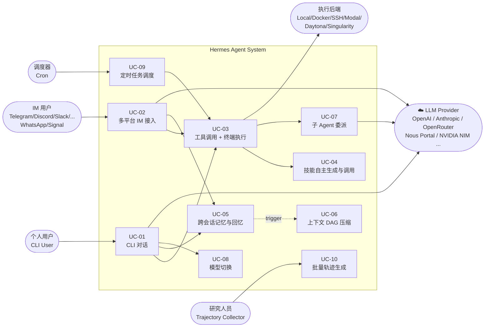
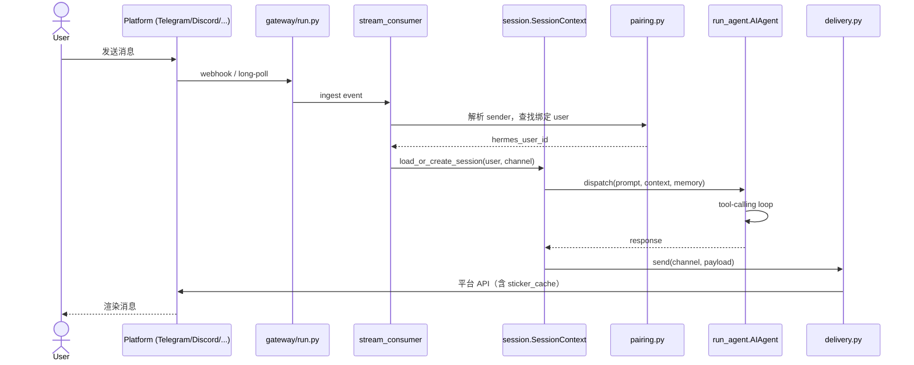
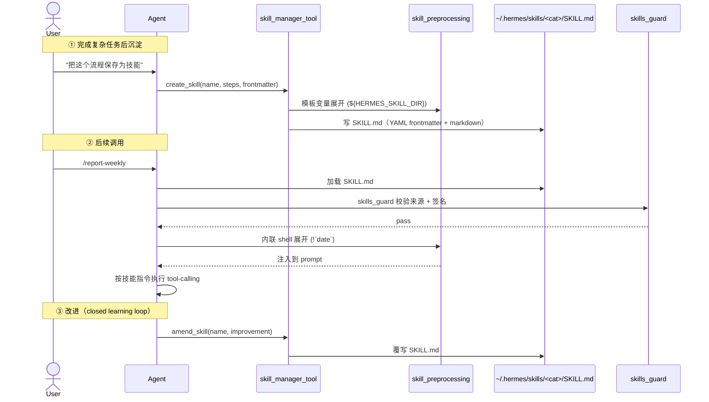
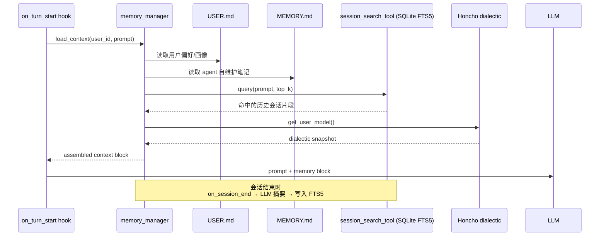
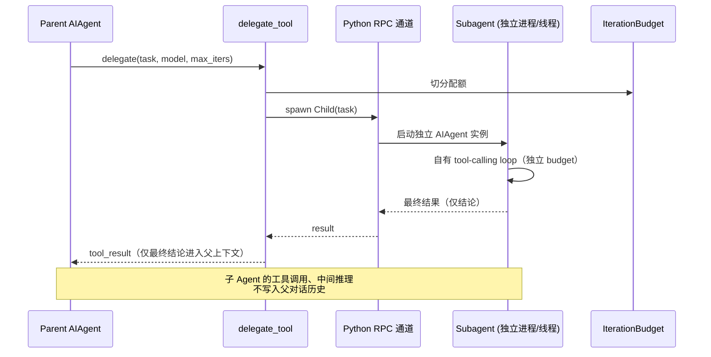
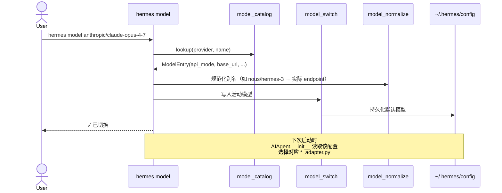
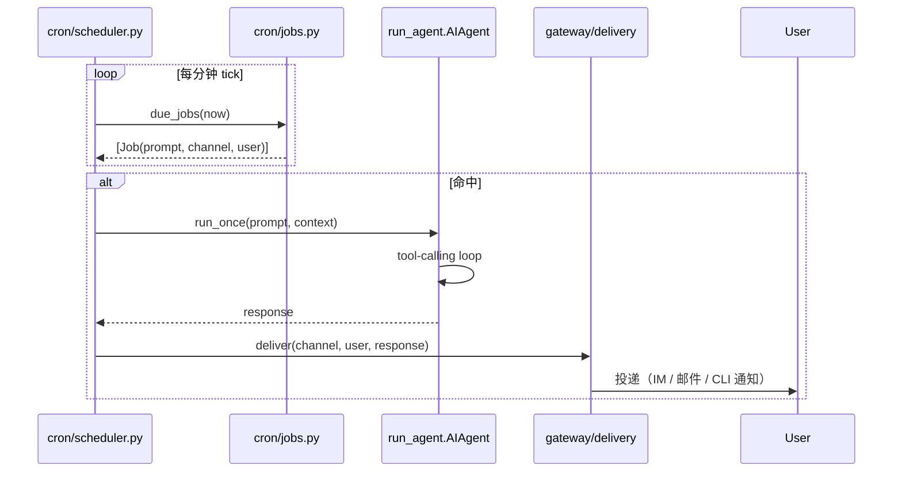
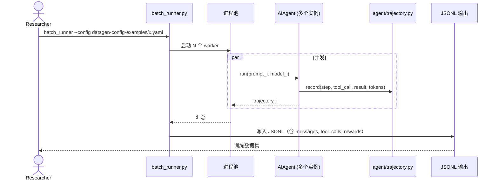

# 场景视图 (Scenarios / Use Cases — "+1")

> 场景视图是 4+1 架构中的驱动力。以下用例覆盖 Hermes Agent 核心功能，并与其余四个视图形成追踪关系。

---

## 核心用例总览



---

## UC-01：CLI 对话

**参与者**：个人用户 | **目标**：在终端启动 Hermes，进行多轮工具调用对话

```mermaid
sequenceDiagram
    actor User
    participant CLI as hermes_cli.main
    participant Cfg as Config_and_Setup
    participant Run as run_agent.AIAgent
    participant Loop as run_conversation
    participant Adp as ProviderAdapter
    participant LLM as LLM_API

    User->>CLI: hermes
    CLI->>Cfg: load env, model_catalog, tools_config
    CLI->>Run: AIAgent(model, tools, memory, ...)
    Run->>Run: 加载 MEMORY.md / USER.md / Skills
    User->>Loop: 输入 prompt（curses_ui）
    Loop->>Adp: build_messages + tools schema
    Adp->>LLM: chat.completions / messages.create
    LLM-->>Adp: assistant + tool_calls
    Adp-->>Loop: parsed response
    Loop->>Loop: 执行 tool_calls（见 UC-03）
    Loop->>Adp: 追加 tool_result，再次调用
    LLM-->>Adp: 终态回复
    Adp-->>Loop: final assistant text
    Loop-->>User: 流式 token（stream_delta_callback）
```

---

## UC-02：多平台 IM 接入

**参与者**：IM 用户 | **目标**：通过 Telegram/Discord/Slack/WhatsApp/Signal 与 Hermes 对话，会话记忆跨平台延续



> **关键设计**：`pairing.py` 把不同平台的 sender → 同一个 `hermes_user_id`，所以同一用户的 MEMORY/USER/技能在 Telegram 和 Discord 之间是连续的。

---

## UC-03：工具调用 + 终端执行

**参与者**：Agent 主循环（自动触发） | **目标**：执行 LLM 返回的 `tool_call`，结果回填上下文

```mermaid
sequenceDiagram
    participant Loop as run_conversation
    participant Reg as tools.registry
    participant Tool as ToolHandler
    participant Sec as Guards
    participant Term as terminal_tool
    participant Env as TerminalBackend
    participant Store as tool_result_storage

    Loop->>Reg: dispatch(tool_name, args)
    Reg->>Sec: 校验路径 / URL / 权限
    Sec-->>Reg: pass / approval_required
    Reg->>Tool: invoke(args)
    alt 是终端工具
        Tool->>Term: run(cmd)
        Term->>Env: exec via local/docker/ssh/modal/...
        Env-->>Term: stdout/stderr/exit_code
        Term-->>Tool: ToolResult
    else 是其他工具（vision/web/feishu/...）
        Tool->>Tool: 直接执行 Python 函数
    end
    Tool-->>Reg: ToolResult
    Reg->>Store: 持久化大结果（OutputLimiter 截断）
    Reg-->>Loop: tool_result（写回 messages）
```

---

## UC-04：技能自主生成与调用

**参与者**：Agent / 个人用户 | **目标**：完成复杂任务后沉淀为可复用的 Skill；后续以 `/skill-name` 直接调用



---

## UC-05：跨会话记忆与回忆

**参与者**：MemoryManager / FTS5 索引 | **目标**：跨多个历史会话检索，并构建持久用户画像



---

## UC-06：上下文 DAG 压缩

**参与者**：context_engine / context_compressor | **目标**：当上下文逼近模型 token 上限时，自动压缩中段消息

```mermaid
sequenceDiagram
    participant Loop
    participant CE as context_engine
    participant Est as token_estimator
    participant Cmp as context_compressor
    participant LLM

    Loop->>CE: pre_flight(messages, threshold_tokens)
    CE->>Est: estimate(messages)
    Est-->>CE: total_tokens

    alt total_tokens 在阈值内
        CE-->>Loop: pass-through
    else 超出阈值
        CE->>Cmp: build_dag(messages, protect_first_n, protect_last_n)
        Cmp->>Cmp: 识别工具调用簇 / 引用关系
        Cmp->>LLM: summarize(中段簇)
        LLM-->>Cmp: 压缩后摘要节点
        Cmp-->>CE: 压缩后 messages
        CE-->>Loop: compressed messages
    end
```

> 头部（system + 早期关键消息）和尾部（最近 N 条）始终保留，中段以 DAG 节点为单位摘要，引用关系（`context_references`）保证可回溯。

---

## UC-07：子 Agent 委派（零上下文成本）

**参与者**：父 Agent / delegate_tool / 子 AIAgent | **目标**：把可独立完成的子任务委派给子 Agent，结果回写父上下文，但子 Agent 的中间步骤不污染父上下文



---

## UC-08：模型切换

**参与者**：CLI 用户 | **目标**：在 200+ 模型间无代码切换



---

## UC-09：定时任务调度

**参与者**：cron Scheduler | **目标**：在固定时间触发 Agent 任务（如每日报告、定期巡检）



---

## UC-10：批量轨迹生成（研究场景）

**参与者**：研究人员 | **目标**：批量跑 prompts，收集结构化 trajectory 用于 RL/SFT 训练



---

## 用例与其他视图的追踪

| 用例 | 关联逻辑组件 | 关联进程 | 部署节点 |
|------|--------------|----------|----------|
| UC-01 CLI 对话 | hermes_cli, AIAgent | Main process | 用户主机 |
| UC-02 IM 接入 | gateway/, AIAgent | Gateway process + Agent process | 服务器 / VPS |
| UC-03 工具执行 | tools/registry, terminal_tool | Tool dispatcher | 用户主机 + 远端 backend |
| UC-04 技能 | skill_manager_tool, skills/ | Inline | 文件系统 |
| UC-05 记忆 | memory_manager, session_search_tool | Inline | SQLite + Honcho 服务 |
| UC-06 压缩 | context_engine, context_compressor | Pre-call hook | Inline |
| UC-07 子 Agent | delegate_tool | Subprocess / RPC | 同机或 Modal |
| UC-08 模型切换 | model_catalog, *_adapter.py | Config 修改 | 用户主机 |
| UC-09 调度 | cron/scheduler | 后台线程 | 同 Agent 主机 |
| UC-10 批量 | batch_runner, trajectory | 多进程 | 用户主机 / Modal 集群 |
