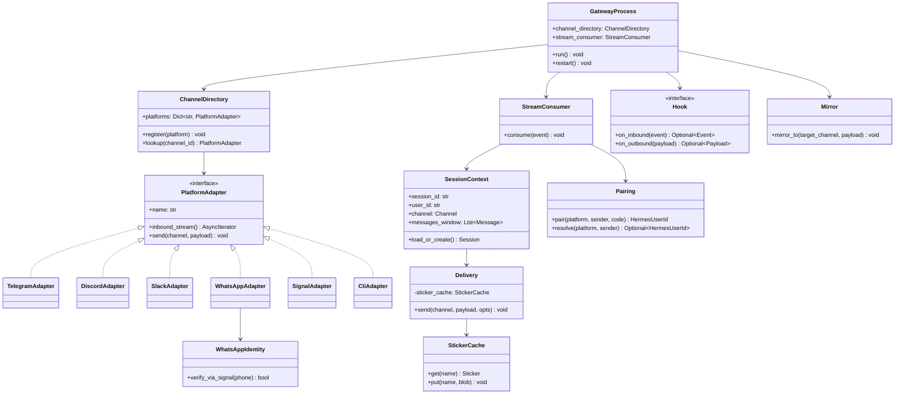
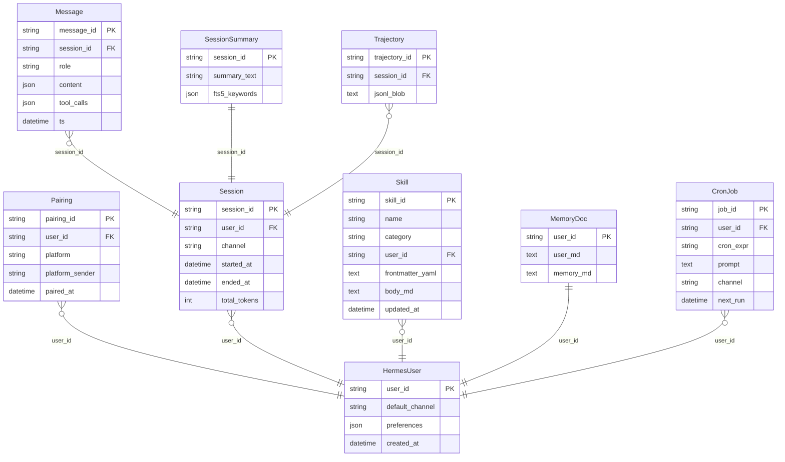
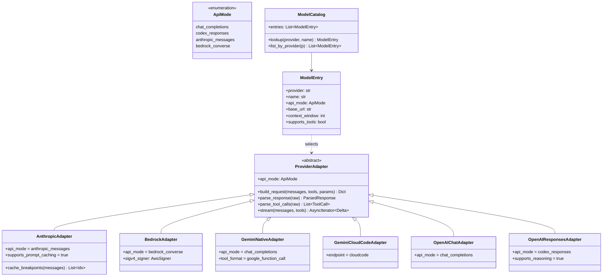

# 逻辑视图 (Logical View)

> 描述系统的核心抽象与功能分解，聚焦类/接口的结构与关系，与部署/进程无关。

---

## 1. 顶层组件分解

```mermaid
flowchart TB
    subgraph CLI["CLI Layer — hermes_cli/"]
        Main["main.py\n入口 + 子命令路由"]
        Cmds["commands.py"]
        AuthC["auth_commands\ncopilot_auth\ndingtalk_auth"]
        Cfg["config.py + setup.py\nenv_loader.py"]
        Cat["model_catalog\nmodel_switch\nmodel_normalize"]
        UI["curses_ui / cli_output\nbanner / colors"]
        Web["web_server.py\nwebhook.py"]
    end

    subgraph Gateway["Gateway Layer — gateway/"]
        GRun["run.py"]
        Stream["stream_consumer"]
        Sess["session.py\nsession_context"]
        Pair["pairing.py"]
        Del["delivery.py"]
        Mirror["mirror.py"]
        Hooks["hooks.py + builtin_hooks/"]
        Plats["platforms/\n(Telegram/Discord/Slack/WA/Signal)"]
        Sticker["sticker_cache"]
    end

    subgraph Agent["Agent Core — agent/ + run_agent.py"]
        AIA["AIAgent\n(run_agent.py)"]
        PB["prompt_builder\nprompt_caching"]
        CE["context_engine\ncontext_compressor\ncontext_references"]
        MM["memory_manager\nmemory_provider"]
        Skill["skill_commands\nskill_preprocessing\nskill_utils"]
        Traj["trajectory"]
        Adp["Provider Adapters\nanthropic / bedrock / gemini\nopenai (chat / responses)"]
        Cred["credential_pool\ncredential_sources"]
        Rate["rate_limit_tracker\nnous_rate_guard"]
        Err["error_classifier"]
        Aux["auxiliary_client"]
        Hook["shell_hooks"]
    end

    subgraph Tools["Tool Layer — tools/"]
        Reg["registry.py"]
        Term["terminal_tool"]
        File["file_tools\nfile_operations"]
        Browser["browser_tool\nbrowser_cdp_tool\nbrowser_camofox\nbrowser_dialog\nbrowser_supervisor"]
        Web2["web_tools\nurl_safety\nwebsite_policy"]
        Code["code_execution_tool"]
        Del2["delegate_tool\nclarify_tool\nsend_message_tool\napproval"]
        Mem["memory_tool"]
        Skl["skills_tool\nskill_manager_tool\nskills_guard"]
        Search["session_search_tool"]
        Todo["todo_tool"]
        Cron2["cronjob_tools"]
        IM["discord_tool\nfeishu_doc_tool\nfeishu_drive_tool\nhomeassistant_tool"]
        AI["image_generation_tool\ntts_tool / neutts_synth\ntranscription_tools\nvision_tools\nvoice_mode"]
        MCP["mcp_tool\nmcp_oauth\nmcp_oauth_manager"]
        Sec["path_security\ntirith_security\nosv_check\nschema_sanitizer"]
        Cfg2["budget_config\ncheckpoint_manager\nprocess_registry\ntool_result_storage"]
    end

    subgraph Env["Execution Env — environments/"]
        Base["HermesBaseEnv"]
        Loop2["agent_loop"]
        TC["tool_context"]
        Parse["tool_call_parsers/"]
        Bench["benchmarks/\nhermes_swe_env\nterminal_test_env"]
    end

    subgraph Sched["Scheduler — cron/"]
        SchedSvc["scheduler.py"]
        Jobs["jobs.py"]
    end

    subgraph Plug["Plugins — plugins/"]
        PCE["context_engine\nmemory"]
        PIM["image_gen\nspotify\ngoogle_meet"]
        POp["disk-cleanup\nstrike-freedom-cockpit"]
    end

    Main --> Cfg
    Main --> Cat
    Main --> AIA
    Main --> UI
    Main --> Web

    GRun --> Stream
    Stream --> Pair
    Stream --> Sess
    Sess --> AIA
    Sess --> Del
    Del --> Plats
    GRun --> Hooks

    AIA --> PB
    AIA --> CE
    AIA --> MM
    AIA --> Adp
    AIA --> Cred
    AIA --> Rate
    AIA --> Err
    AIA --> Traj
    AIA --> Reg
    AIA --> Skill
    AIA --> Hook
    AIA -.uses.-> Aux

    Reg --> Term
    Reg --> File
    Reg --> Browser
    Reg --> Web2
    Reg --> Code
    Reg --> Del2
    Reg --> Mem
    Reg --> Skl
    Reg --> Search
    Reg --> Todo
    Reg --> Cron2
    Reg --> IM
    Reg --> AI
    Reg --> MCP
    Reg --> Sec
    Reg --> Cfg2

    Term --> Env
    Env --> Loop2
    Env --> TC
    Env --> Parse

    SchedSvc --> Jobs
    Jobs --> AIA

    Plug -.extends.-> AIA
    Plug -.extends.-> Reg
```

---

## 2. AIAgent 核心类图

```mermaid
classDiagram
    class AIAgent {
        +model: str
        +provider: str
        +api_mode: ApiMode
        +tools: List~ToolDef~
        +valid_tool_names: Set~str~
        +messages: List~Message~
        +iteration_budget: IterationBudget
        +context_compressor: ContextCompressor
        +memory_manager: MemoryManager
        +trajectory: Trajectory
        +tool_progress_callback: Callable
        +thinking_callback: Callable
        +stream_delta_callback: Callable
        -_interrupt_requested: bool
        -_pending_steer: Optional~str~
        +run_conversation(prompt) Response
        +run_once(prompt) Response
        +interrupt() void
        +steer(guidance) void
        +delegate(task, model, max_iters) Response
    }

    class IterationBudget {
        +max_iterations: int
        +remaining: int
        +consume(n) bool
        +child_budget(fraction) IterationBudget
    }

    class ContextCompressor {
        +threshold_tokens: int
        +protect_first_n: int
        +protect_last_n: int
        +pre_flight(messages) List~Message~
        +compress(messages) List~Message~
    }

    class MemoryManager {
        +builtin_provider: MemoryProvider
        +plugin_provider: Optional~MemoryProvider~
        +on_turn_start(ctx) MemoryBlock
        +on_session_end(ctx) void
        +on_pre_compress(ctx) void
        +on_delegation(child_ctx) void
    }

    class MemoryProvider {
        <<interface>>
        +load(user_id) MemoryBlock
        +save(user_id, block) void
    }

    class Trajectory {
        +steps: List~Step~
        +record(step_type, payload) void
        +export_jsonl() str
    }

    class CredentialPool {
        +sources: List~CredentialSource~
        +get(provider) ApiKey
        +rotate(provider) void
    }

    class CredentialSource {
        <<interface>>
        +supports(provider) bool
        +fetch() ApiKey
    }

    class ProviderAdapter {
        <<interface>>
        +api_mode: ApiMode
        +build_request(messages, tools) Dict
        +parse_response(raw) ParsedResponse
        +stream(messages, tools) AsyncIterator
    }

    class AnthropicAdapter
    class BedrockAdapter
    class GeminiNativeAdapter
    class GeminiCloudCodeAdapter
    class OpenAIChatAdapter
    class OpenAIResponsesAdapter

    class RateLimitTracker {
        +budget: BudgetConfig
        +track(provider, tokens, cost) void
        +check_limits() Optional~Throttle~
    }

    class NousRateGuard {
        +pre_call(provider) void
        +post_call(provider, headers) void
    }

    class ErrorClassifier {
        +classify(exc) ErrorClass
        +should_retry(error) bool
        +backoff(error, attempt) float
    }

    AIAgent --> IterationBudget
    AIAgent --> ContextCompressor
    AIAgent --> MemoryManager
    AIAgent --> Trajectory
    AIAgent --> ProviderAdapter
    AIAgent --> CredentialPool
    AIAgent --> RateLimitTracker
    AIAgent --> NousRateGuard
    AIAgent --> ErrorClassifier

    MemoryManager --> MemoryProvider
    CredentialPool --> CredentialSource

    ProviderAdapter <|.. AnthropicAdapter
    ProviderAdapter <|.. BedrockAdapter
    ProviderAdapter <|.. GeminiNativeAdapter
    ProviderAdapter <|.. GeminiCloudCodeAdapter
    ProviderAdapter <|.. OpenAIChatAdapter
    ProviderAdapter <|.. OpenAIResponsesAdapter
```

---

## 3. 工具系统类图

```mermaid
classDiagram
    class ToolRegistry {
        -tools: Dict~str, ToolHandler~
        -guards: List~Guard~
        +register(handler) void
        +dispatch(name, args, ctx) ToolResult
        +schemas() List~ToolSchema~
    }

    class ToolHandler {
        <<interface>>
        +name: str
        +schema: ToolSchema
        +invoke(args, ctx) ToolResult
    }

    class ToolResult {
        +stdout: str
        +stderr: str
        +exit_code: int
        +artifacts: List~Artifact~
        +truncated: bool
    }

    class Guard {
        <<interface>>
        +check(name, args, ctx) GuardDecision
    }

    class PathSecurity {
        +check_path(path, allow_roots) bool
    }
    class UrlSafety {
        +check_url(url, policy) bool
    }
    class SchemaSanitizer {
        +sanitize(args, schema) Dict
    }
    class SkillsGuard {
        +verify_origin(skill) bool
    }
    class TirithSecurity {
        +static_scan(code) Findings
    }

    class TerminalTool {
        +backend: TerminalBackend
        +run(cmd, cwd, env, timeout) ToolResult
    }

    class TerminalBackend {
        <<interface>>
        +exec(cmd, cwd, env) Process
    }
    class LocalBackend
    class DockerBackend
    class SshBackend
    class ModalBackend
    class DaytonaBackend
    class SingularityBackend

    class BrowserTool {
        +driver: BrowserDriver
        +navigate(url) Page
        +interact(action) Result
    }

    class BrowserDriver {
        <<interface>>
    }
    class CdpDriver
    class CamofoxDriver

    class DelegateTool {
        +delegate(task, model, max_iters) ToolResult
    }

    class McpTool {
        +servers: List~McpServer~
        +list_tools() List~ToolSchema~
        +call(server, tool, args) ToolResult
    }

    class McpOAuthManager {
        +get_token(server) Token
        +refresh(server) Token
    }

    class CheckpointManager {
        +snapshot(label) CheckpointId
        +restore(id) void
    }

    class ToolResultStorage {
        +save(tool_call_id, payload) Ref
        +load(ref) bytes
    }

    ToolRegistry --> ToolHandler
    ToolRegistry --> Guard
    ToolHandler ..> ToolResult

    Guard <|.. PathSecurity
    Guard <|.. UrlSafety
    Guard <|.. SchemaSanitizer
    Guard <|.. SkillsGuard
    Guard <|.. TirithSecurity

    ToolHandler <|.. TerminalTool
    ToolHandler <|.. BrowserTool
    ToolHandler <|.. DelegateTool
    ToolHandler <|.. McpTool

    TerminalTool --> TerminalBackend
    TerminalBackend <|.. LocalBackend
    TerminalBackend <|.. DockerBackend
    TerminalBackend <|.. SshBackend
    TerminalBackend <|.. ModalBackend
    TerminalBackend <|.. DaytonaBackend
    TerminalBackend <|.. SingularityBackend

    BrowserTool --> BrowserDriver
    BrowserDriver <|.. CdpDriver
    BrowserDriver <|.. CamofoxDriver

    McpTool --> McpOAuthManager
    ToolRegistry --> ToolResultStorage
    ToolRegistry --> CheckpointManager
```

---

## 4. Gateway 类图

---

## 5. 数据/持久化模型（核心实体）

> 实体名为逻辑命名；实际持久化以**文件 + SQLite FTS5** 为主，无强 schema 数据库依赖。

---

## 6. Provider 适配层（解耦关键）

> 切换模型不改业务代码：`ModelCatalog.lookup()` 给出 `ApiMode`，`AIAgent.__init__` 据此选择对应 Adapter。

---

## 7. 关键不变量

- **MemoryManager 单内建 + 单插件 Provider**：`memory_manager.py` 强制只允许一个内建 + 至多一个外部插件，避免 tool schema 膨胀和冲突
- **IterationBudget 父子继承**：父 Agent 的 budget 默认 90，每个 `delegate_tool` 调用按比例切分给子 Agent，禁止子 Agent 反向消费父配额
- **Skill 解析顺序**：`skill_preprocessing` 必须在 `skills_guard.verify_origin` 通过后才能执行内联 shell 展开，防止恶意技能逃逸
- **ToolResult 截断**：`OutputLimiter` 对超大输出落盘到 `tool_result_storage`，仅在上下文中保留 ref + 摘要
- **Provider Adapter 单一职责**：Adapter 只做协议转换，credential 由 `credential_pool` 提供、限流由 `rate_limit_tracker` 处理
