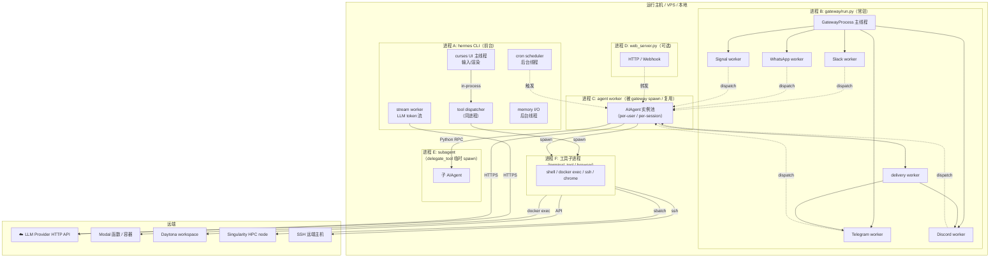
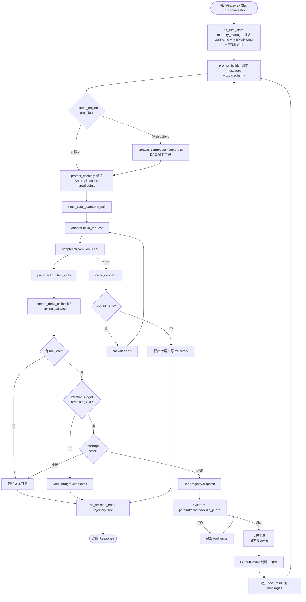
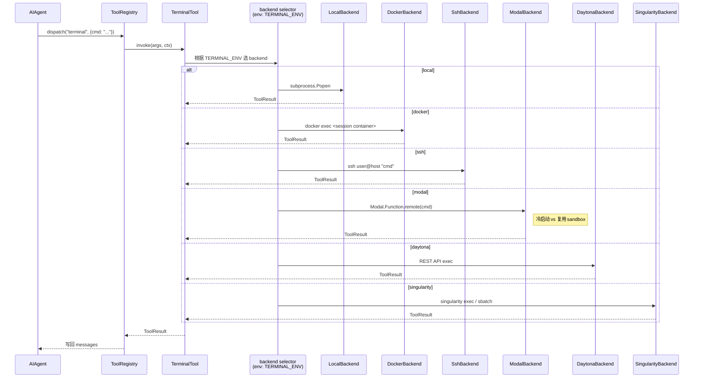
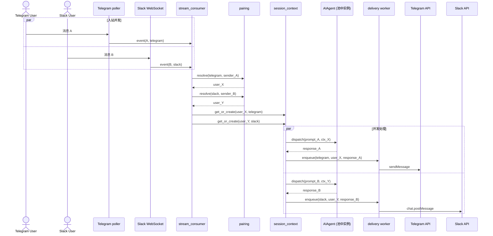
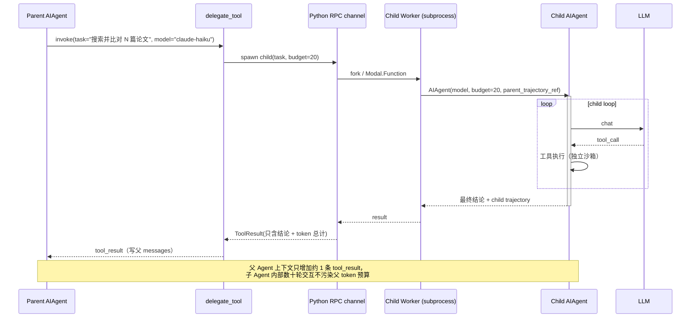
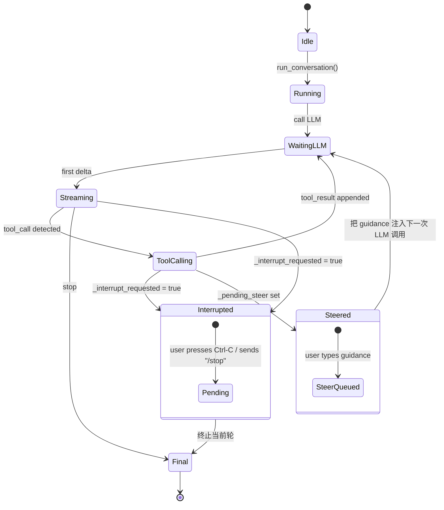
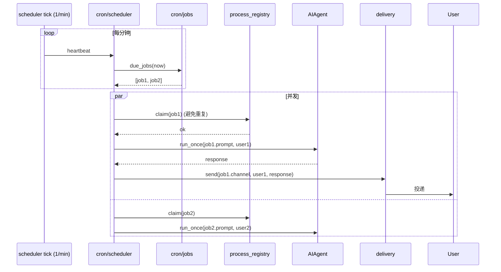
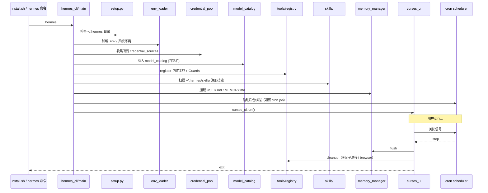

# 过程视图 (Process View)

> 描述运行时进程/线程划分、生命周期、并发与通信，体现"系统是怎么跑起来的"。

---

## 1. 运行时进程拓扑



> **进程边界设计**：CLI 用例下 Agent 与 UI 同进程；多平台 IM 部署下 Gateway 与 Agent 解耦，Agent 池化复用，便于 OOM 隔离。

---

## 2. AIAgent 主循环（核心运行时）



---

## 3. 工具调用 → 终端后端的运行时分派



---

## 4. Gateway 消息流（多平台 fan-in / fan-out）



> **关键**：`stream_consumer` 是单写者多读者；`Agent 池` 通过 user_id 哈希分桶，保证同一用户的多次请求顺序处理；不同用户并行。

---

## 5. 子 Agent 委派（独立 budget + 独立上下文）



---

## 6. 上下文压缩触发时序

```mermaid
sequenceDiagram
    participant Loop as run_conversation
    participant CE as context_engine
    participant Ref as context_references
    participant Cmp as context_compressor
    participant LLM as Summarizer LLM
    participant MM as memory_manager

    Loop->>CE: pre_flight(messages, model.context_window)
    CE->>CE: 估算 token，比较 threshold

    alt 超阈值
        CE->>MM: on_pre_compress(messages)
        Note right of MM: 给 memory 一次 "保存重要信息" 机会
        MM-->>CE: 已写 MEMORY.md
        CE->>Ref: 提取引用关系（tool_call ↔ tool_result）
        CE->>Cmp: build_dag(messages, protect_first_n, protect_last_n)
        Cmp->>Cmp: 把中段消息按 DAG 簇划分
        loop 每个簇
            Cmp->>LLM: summarize(cluster)
            LLM-->>Cmp: 摘要节点
        end
        Cmp-->>CE: compressed messages
        CE-->>Loop: 替换 messages
    else 未超
        CE-->>Loop: pass-through
    end
```

---

## 7. 中断与 Steer（用户在 tool loop 中插话）



---

## 8. Cron 调度时序



---

## 9. 错误处理与 Provider 限流

```mermaid
sequenceDiagram
    participant Loop as AIAgent loop
    participant Adp as ProviderAdapter
    participant Guard as nous_rate_guard
    participant Track as rate_limit_tracker
    participant Cls as error_classifier
    participant LLM

    Loop->>Guard: pre_call(provider)
    Guard->>Track: 当前 RPM/TPM 已用?
    Track-->>Guard: usage
    alt 接近上限
        Guard-->>Loop: sleep(jitter)
    end
    Loop->>Adp: stream(messages)
    Adp->>LLM: HTTP

    alt 200 OK
        LLM-->>Adp: stream
        Adp-->>Loop: deltas
        Loop->>Track: track(provider, usage_headers, cost)
    else 429 / 5xx / network
        LLM-->>Adp: error
        Adp->>Cls: classify(exc)
        Cls-->>Adp: ErrorClass{retryable, backoff_s}
        alt retryable
            Adp->>Adp: sleep(backoff)
            Adp->>LLM: 重试（最多 N 次）
        else 不可重试
            Adp-->>Loop: raise
            Loop->>Loop: 写入 trajectory + memory
        end
    end
```

---

## 10. 启动 / 关闭顺序


