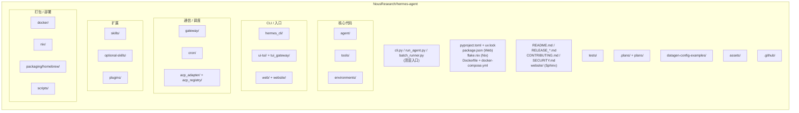
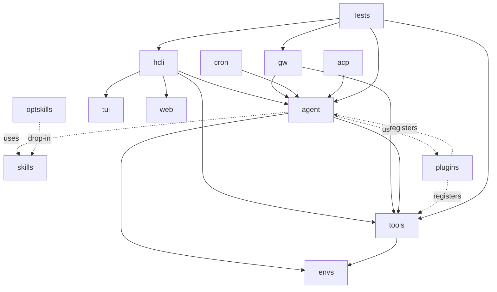
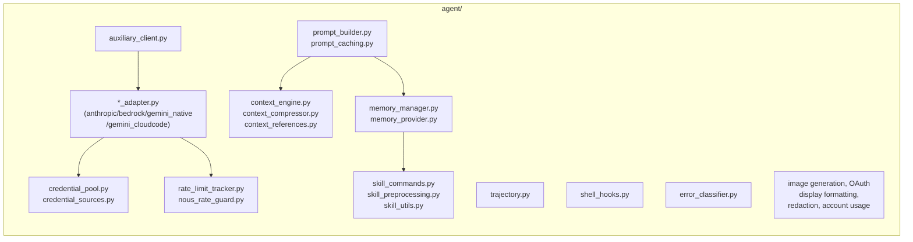
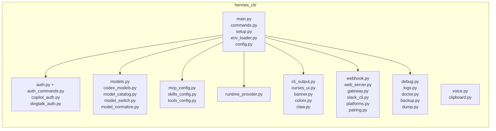
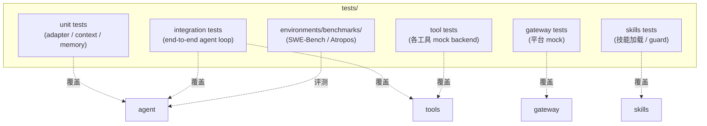

# 开发视图 (Development View)

> 描述源码组织、模块依赖与构建方式，面向贡献者与二次开发者。

---

## 1. 仓库顶层布局



---

## 2. 模块依赖（高层）



> **依赖原则**：`tools/` 只依赖 `environments/`，不反向依赖 `agent/`；`agent/` 通过 `tools/registry` 单向调用；`gateway/` 依赖 `agent/` 但不直接依赖 `tools/`。

---

## 3. 关键包详解

### 3.1 `agent/`



| 模块 | 角色 | 关键依赖 |
|------|------|----------|
| `*_adapter.py` | Provider 协议适配（chat/messages/converse/responses） | `credential_pool`, `rate_limit_tracker` |
| `context_engine.py` | 上下文 token 预算 / 压缩触发 | `context_compressor`, `memory_manager` |
| `context_compressor.py` | DAG 摘要中段消息 | LLM（小模型摘要） |
| `memory_manager.py` | MEMORY/USER.md + 插件 Provider 协调 | `memory_provider` |
| `prompt_builder.py` | 拼接 system + memory + history | `context_engine`, `prompt_caching` |
| `prompt_caching.py` | Anthropic cache_control 标记 | Adapter 层使用 |
| `trajectory.py` | 记录推理 / 工具步骤（导出 JSONL） | 被 `batch_runner` 消费 |
| `credential_pool.py` | 多 source key 池 + 轮换 | `credential_sources` |
| `nous_rate_guard.py` | Nous Portal 专属限流保护 | `rate_limit_tracker` |
| `error_classifier.py` | 重试策略决策 | 各 Adapter |

### 3.2 `tools/`

```mermaid
flowchart LR
    subgraph T["tools/"]
        Reg["registry.py\n(总入口)"]
        Term["terminal_tool.py"]
        Files["file_tools.py\nfile_operations.py"]
        Code["code_execution_tool.py"]
        Br["browser_tool.py\nbrowser_cdp_tool.py\nbrowser_camofox.py\nbrowser_dialog_tool.py\nbrowser_supervisor.py"]
        Web2["web_tools.py\nurl_safety.py\nwebsite_policy.py"]
        Coll["delegate_tool.py\nclarify_tool.py\napproval.py\ninterrupt.py\nsend_message_tool.py"]
        Mem2["memory_tool.py"]
        Skl2["skills_tool.py\nskill_manager_tool.py\nskills_guard.py"]
        Search["session_search_tool.py"]
        Todo["todo_tool.py"]
        Cron2["cronjob_tools.py"]
        IM["discord_tool.py\nfeishu_doc_tool.py\nfeishu_drive_tool.py\nhomeassistant_tool.py"]
        AI["image_generation_tool.py\nvision_tools.py\ntts_tool.py / neutts_synth.py\ntranscription_tools.py\nvoice_mode.py"]
        MCP["mcp_tool.py\nmcp_oauth.py\nmcp_oauth_manager.py"]
        Sec["path_security.py\ntirith_security.py\nosv_check.py\nschema_sanitizer.py"]
        Mgmt["budget_config.py\ncheckpoint_manager.py\nprocess_registry.py\ntool_result_storage.py"]
    end

    Reg --> Term
    Reg --> Files
    Reg --> Code
    Reg --> Br
    Reg --> Web2
    Reg --> Coll
    Reg --> Mem2
    Reg --> Skl2
    Reg --> Search
    Reg --> Todo
    Reg --> Cron2
    Reg --> IM
    Reg --> AI
    Reg --> MCP
    Reg --> Sec
    Reg --> Mgmt
```



> 工具按"职能簇"分组管理，但 `registry.py` 是**唯一入口**——避免直接 import 引入循环依赖。

### 3.3 `environments/`

| 文件 | 角色 |
|------|------|
| `hermes_base_env.py` | `HermesAgentBaseEnv`：设置 `TERMINAL_ENV` 等环境变量 |
| `agent_loop.py` | RL/Atropos 兼容的 step loop 包装 |
| `tool_context.py` | 注入到工具的运行时上下文 |
| `tool_call_parsers/` | 多 Provider 的 tool_call 解析器 |
| `patches.py` | monkey-patch（兼容性补丁） |
| `terminal_test_env/` | 测试 backend 用的最小环境 |
| `hermes_swe_env/` | SWE-Bench 专用环境 |
| `benchmarks/` | 基准评测环境 |

### 3.4 `gateway/`

| 文件 | 角色 |
|------|------|
| `run.py` | Gateway 进程入口 |
| `channel_directory.py` | 平台注册表 |
| `platforms/` | 各 IM 平台 Adapter |
| `stream_consumer.py` | 入站消息流处理 |
| `session.py`, `session_context.py` | 会话状态 |
| `pairing.py` | 用户绑定（多平台 → hermes_user_id） |
| `whatsapp_identity.py` | WA 身份特殊验证 |
| `delivery.py`, `mirror.py` | 出站投递 / 镜像 |
| `hooks.py`, `builtin_hooks/` | 入/出站 hook |
| `sticker_cache.py` | 贴纸缓存（IM 富媒体） |
| `display_config.py` | 渲染配置 |
| `restart.py`, `status.py` | 进程治理 |

### 3.5 `hermes_cli/`

约 60+ 模块，按职能分组：



### 3.6 `skills/`（按领域分类）

| 类别目录 | 示例 | 说明 |
|----------|------|------|
| `software-development/` | Git / Code Review / Refactor | 编码助手 |
| `research/` | 论文检索 / 总结 | 学术研究 |
| `data-science/` / `mlops/` | 数据清洗 / 模型部署 | DS/MLOps |
| `devops/` | webhook-subscriptions | 运维 |
| `email/` / `note-taking/` / `productivity/` | 个人效率 | 日常 |
| `social-media/` / `media/` / `gifs/` | 社交媒体管理 | 内容创作 |
| `creative/` / `diagramming/` / `gaming/` | 创意类 | 内容生成 |
| `apple/` / `smart-home/` | 系统集成 | 设备控制 |
| `github/` | PR / Issue | 仓库自动化 |
| `mcp/` | MCP server 模板 | MCP 集成 |
| `red-teaming/godmode/` | 红队 / godmode | 安全测试 |
| `dogfood/` | Hermes 自身改进 | meta |
| `domain/` | 领域专用 | 垂直 |
| `index-cache/` / `inference-sh/` / `yuanbao/` | 第三方专用 | 三方接入 |
| `autonomous-ai-agents/` | Agent 模板 | 元技能 |

> **技能格式**：YAML frontmatter（name/description/parameters/version）+ Markdown body（指令 / 模板变量 / 内联 shell）。兼容 [agentskills.io](https://agentskills.io) 标准。

### 3.7 `plugins/`

| 插件 | 类型 | 作用 |
|------|------|------|
| `context_engine` | 替换/扩展 context engine | 自定义压缩策略 |
| `memory` | 自定义 MemoryProvider | 接入向量库等 |
| `image_gen` | 工具插件 | 第三方图像生成 |
| `spotify` / `google_meet` | 工具插件 | 第三方服务 |
| `disk-cleanup` / `strike-freedom-cockpit` | 运维 / 控制台 | 自定义 dashboard |
| `example-dashboard/dashboard` | 模板 | 编写新插件参考 |

---

## 4. 构建 / 包管理

```mermaid
flowchart LR
    subgraph PyMgr["Python: uv"]
        Pyproj[pyproject.toml]
        Lock[uv.lock]
    end
    subgraph JSMgr["Web: npm"]
        Pkg[package.json]
        WebSrc[web/ + website/]
    end
    subgraph Sys["系统包"]
        Brew[packaging/homebrew/]
        Nix[flake.nix + nix/]
        Docker2[Dockerfile + docker/]
    end
    subgraph Distrib["发布"]
        Inst[scripts/install.sh\n(curl | bash)]
        Rel[RELEASE_*.md]
        GH[.github/workflows]
    end

    Pyproj --> Lock
    Lock -->|uv sync| Inst
    Pkg -->|npm i / pnpm| WebSrc
    Brew --> Inst
    Nix --> Inst
    Docker2 --> GH
    GH --> Rel
```

| 工具 | 用途 |
|------|------|
| **uv** | Python 依赖与虚拟环境（替代 pip + venv） |
| **flake.nix** | Nix 复现性构建 |
| **homebrew formula** | macOS / Linuxbrew 一键安装 |
| **install.sh** | curl-bash 安装器（Linux/macOS/WSL2/Termux） |
| **Dockerfile** | 容器镜像 |
| **GitHub Actions** | CI（test / lint / release） |

---

## 5. 测试组织



---

## 6. 扩展点（开发者关心）

| 扩展点 | 接口 | 写在哪 |
|--------|------|--------|
| 新增 LLM Provider | 实现 `ProviderAdapter` 抽象 | `agent/<name>_adapter.py` + 在 `model_catalog` 注册 |
| 新增执行 backend | 实现 `TerminalBackend` | `tools/terminal_tool.py` + 环境变量分发 |
| 新增工具 | 实现 `ToolHandler` | `tools/<name>_tool.py` + `registry.register()` |
| 新增 IM 平台 | 实现 `PlatformAdapter` | `gateway/platforms/<name>.py` |
| 新增技能 | 写 `SKILL.md`（YAML + body） | `skills/<category>/<name>/SKILL.md` 或 `~/.hermes/skills/...` |
| 新增 MemoryProvider | 实现 `MemoryProvider` | `plugins/memory/<name>` 或独立 pip 包 |
| 新增 Hook | 实现 `Hook` | `gateway/builtin_hooks/<name>.py` |
| 新增凭证源 | 实现 `CredentialSource` | `agent/credential_sources.py` 注册 |
| 新增 Guard | 实现 `Guard` | `tools/<name>_security.py` 注册 |

---

## 7. 编码约定（从仓库结构推断）

- **包入口集中**：`registry.py`（tools）、`channel_directory.py`（gateway）、`model_catalog.py`（cli），避免散点 import
- **强类型**：广泛使用 `dataclass` / `pydantic` / `typing.TypedDict`（适配 OpenAI/Anthropic schema）
- **异步优先**：Adapter 与 Gateway 全 async；同步工具用 `asyncio.to_thread` 包装
- **配置外置**：`~/.hermes/config.yaml` + `.env` + 命令行 flag 三层覆盖
- **可观测**：`trajectory.py` 是一等公民，所有循环都写 step；`logs.py` + `debug.py` 提供分级日志
- **安全显式**：所有外部输入路径必走 `path_security`，所有 URL 必走 `url_safety`，所有技能加载必走 `skills_guard`
