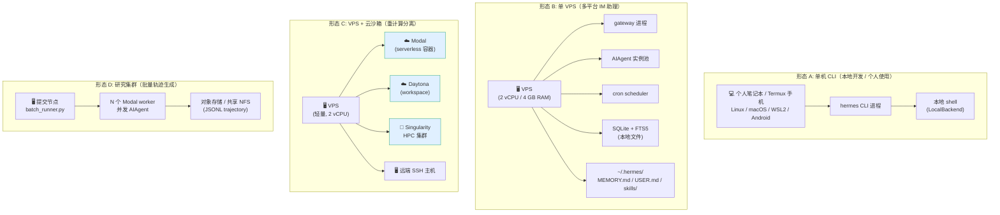
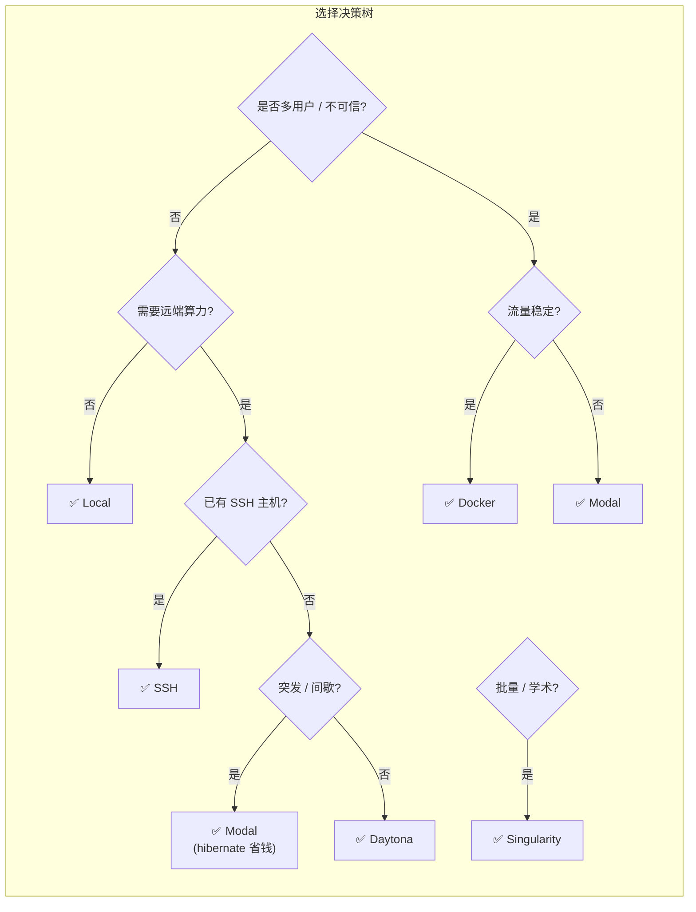
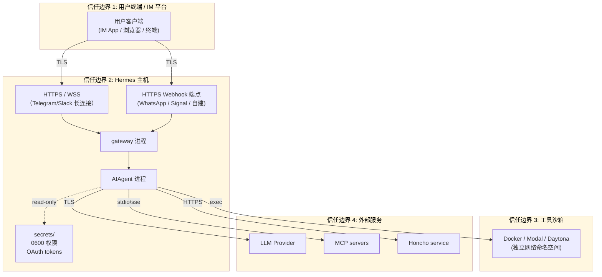
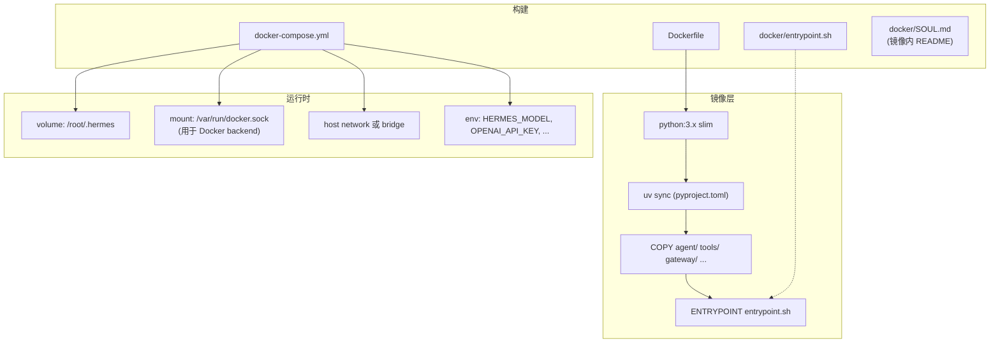
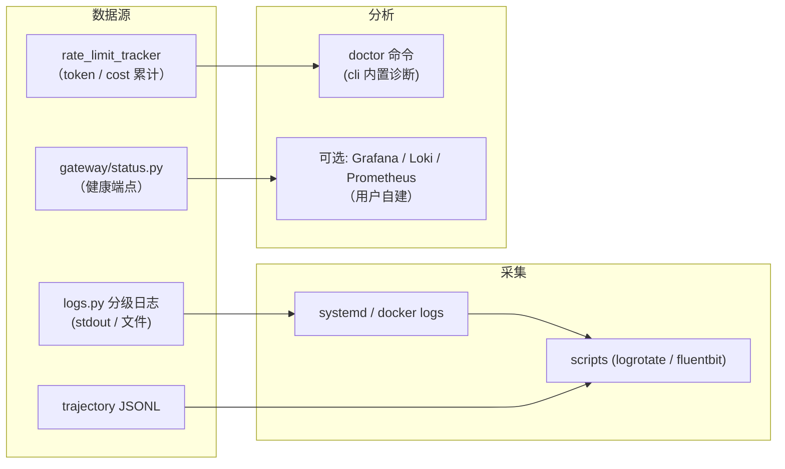
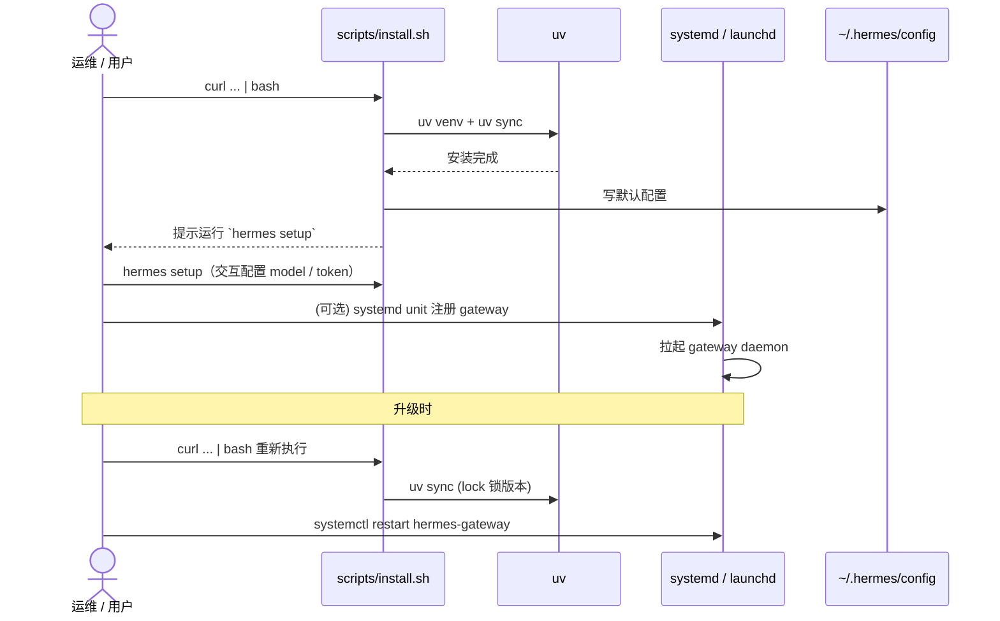

# 物理视图 (Physical View)

> 描述软件构件到硬件/基础设施节点的映射，反映"系统跑在哪里、怎么跑"。

---

## 1. 部署形态总览

Hermes 的部署灵活度是其核心卖点之一，文档明确给出从 **预算 VPS** 到 **云集群** 的多种形态：



---

## 2. 标准部署：多平台 IM 助理（形态 B + C 混合）

```mermaid
flowchart TB
    subgraph Internet["互联网"]
        TG["☁️ Telegram Cloud"]
        DC["☁️ Discord"]
        SK["☁️ Slack"]
        WA["☁️ WhatsApp Cloud"]
        SG["☁️ Signal Server"]
    end

    subgraph CDN["LLM 提供商"]
        OAI["☁️ OpenAI"]
        ANT["☁️ Anthropic"]
        OR["☁️ OpenRouter"]
        Nous["☁️ Nous Portal"]
        NIM["☁️ NVIDIA NIM"]
    end

    subgraph VPS["主机：Linux VPS（systemd 托管）"]
        direction TB
        subgraph Procs["进程"]
            GW["gateway 进程\n(asyncio, 1 进程多 worker 协程)"]
            Web["web_server.py（可选）\nWebhook 端点"]
            APool["AIAgent 实例池\n(per-user 隔离)"]
            Cron3["cron scheduler\n(后台线程)"]
        end

        subgraph Local["本地存储"]
            FS["~/.hermes/\nUSER.md, MEMORY.md\nskills/, sessions/, trajectories/"]
            DB["sqlite (FTS5 索引)"]
            Cred["secrets/\n(0600 权限)"]
        end

        subgraph Sandbox["执行沙箱（任选）"]
            Local2["Local shell"]
            Doc["Docker engine\n(per-session container)"]
        end
    end

    subgraph Cloud["云端可选执行后端"]
        Modal2["☁️ Modal\n(serverless, 自动 hibernation)"]
        Daytona2["☁️ Daytona workspace"]
        SshNode["🖥️ Remote SSH host"]
    end

    subgraph Optional["可选外部服务"]
        Honcho["☁️ Honcho dialectic\n用户建模服务"]
        MCP3["🌐 MCP servers\n(stdio / sse)"]
    end

    TG --> GW
    DC --> GW
    SK --> GW
    WA --> GW
    SG --> GW

    Web --> APool
    GW --> APool
    Cron3 --> APool

    APool --> OAI
    APool --> ANT
    APool --> OR
    APool --> Nous
    APool --> NIM

    APool --> FS
    APool --> DB
    APool --> Cred

    APool --> Local2
    APool --> Doc
    APool --> Modal2
    APool --> Daytona2
    APool --> SshNode

    APool --> Honcho
    APool --> MCP3

    classDef cloud fill:#e0f0ff,stroke:#3a8;
    class TG,DC,SK,WA,SG,OAI,ANT,OR,Nous,NIM,Modal2,Daytona2,Honcho,MCP3 cloud;
```



---

## 3. 终端后端对比（关键决策矩阵）

| Backend | 启动延迟 | 隔离强度 | 状态持久化 | 适用场景 | 成本模型 |
|---------|----------|----------|------------|----------|----------|
| **Local** | 0 | ⚠ 与主机共享 | 用户 home | 个人笔记本 / 信任环境 | 0 |
| **Docker** | 秒级 | 容器级（cgroup + namespace） | volume 挂载 | VPS 默认 / 多用户 | VPS 持续运行 |
| **SSH** | 取决于网络 | 远端主机的隔离 | 远端主机 | 复用已有服务器 | 服务器固定费 |
| **Modal** | 冷启动 ~秒 / 热启动 ms | 容器级 + 网络隔离 | Modal volume / 对象存储 | 间歇性、突发计算 | **按用量计费**，空闲 hibernate |
| **Daytona** | 工作区拉起秒级 | 工作区级 | workspace 卷 | 开发环境云化 | workspace 时长 |
| **Singularity** | sbatch 排队 | 用户态容器 | HPC 共享文件系统 | 学术 HPC / 大型批处理 | 学校 / 集群配额 |



---

## 4. 网络与安全边界



**安全要点**：

- **凭证隔离**：`credential_pool` 把 API key 集中收口，工具子进程不直接接触原始 key
- **路径/URL 守卫**：`path_security` + `url_safety` + `website_policy` 在 tool dispatch 前阻断越权
- **技能签名**：`skills_guard` 校验技能来源，防止恶意 SKILL.md 在加载时执行任意 shell
- **安全扫描**：`tirith_security` 静态扫描 + `osv_check` 检查依赖漏洞
- **沙箱建议**：在多用户/不可信场景，强制使用 Docker/Modal 而非 Local backend

---

## 5. 数据流与持久化位置

```mermaid
flowchart LR
    subgraph Hot["热数据（内存）"]
        Win["session window\n(messages 数组)"]
        Budget2["IterationBudget"]
    end

    subgraph Warm["温数据（本机文件）"]
        UserMd["~/.hermes/USER.md"]
        MemMd["~/.hermes/MEMORY.md"]
        Skills2["~/.hermes/skills/<cat>/SKILL.md"]
        Sess2["~/.hermes/sessions/<id>/"]
        Traj2["~/.hermes/trajectories/<id>.jsonl"]
        Sql["~/.hermes/sessions.db (SQLite + FTS5)"]
        TR["~/.hermes/tool_results/<ref>/"]
    end

    subgraph Cold["冷数据（外部）"]
        Object["对象存储 (S3/Modal Volume)\n大型 trajectory"]
        Honcho3["Honcho user model"]
    end

    Win --> Budget2
    Win -- on_session_end --> Sess2
    Win -- summarize --> Sql
    Win -- 用户/Agent 写 --> UserMd
    Win -- 用户/Agent 写 --> MemMd
    Win -- 沉淀 --> Skills2
    Win -- 步骤记录 --> Traj2
    TR <-- ref 写回 -- Win

    Traj2 -- batch upload --> Object
    UserMd -- sync --> Honcho3
    MemMd -- sync --> Honcho3
```

---

## 6. 资源容量参考

| 形态 | 最低硬件 | 推荐硬件 | 月成本量级 |
|------|----------|----------|------------|
| 形态 A（单机 CLI） | 2 GB RAM, 1 vCPU | 8 GB RAM, 4 vCPU | $0（自有设备） |
| 形态 B（单 VPS） | 1 GB RAM, 1 vCPU | 4 GB RAM, 2 vCPU + 20 GB SSD | $5–$20 |
| 形态 C（VPS + Modal） | VPS 1 GB + Modal 按需 | VPS 4 GB + Modal 配额 | $10–$50（Modal 占大头） |
| 形态 D（研究批量） | 单机 + Modal 集群 | 提交节点 + 50–500 worker | 按 trajectory 数量计 |

> **LLM 调用费用** 与上述硬件成本相互独立，由 `model_switch` + `budget_config` 控制（如限定使用 OpenRouter 免费层、Nous Portal 或本地 vLLM）。

---

## 7. 容器与镜像



**部署变体**：

- **Single container**：`hermes` CLI / `gateway` 二选一作为主进程
- **Compose**：`gateway` + 独立 `cron` + 可选 `web`，挂载共享 `~/.hermes` volume
- **Docker-in-Docker**：当 backend 选 Docker 时，挂 `docker.sock`（注意权限风险）

---

## 8. 可观测性



> Hermes 不内置 APM 集成，但 `trajectory.py` 的 JSONL 输出可直接喂给训练流水线 / 自定义可视化。

---

## 9. 部署 / 升级流程



---

## 10. 与可对比项目的部署对照

| 维度 | Hermes Agent | OpenClaw（参考） |
|------|--------------|------------------|
| 默认部署 | 单进程 CLI / VPS gateway | 单进程 + MCP loopback |
| Backend 数量 | 6（含 Modal/Daytona/Singularity） | 3（Docker/SSH/插件） |
| Serverless 支持 | ✅ Modal 内建 | ❌ |
| HPC 支持 | ✅ Singularity 内建 | ❌ |
| 多平台 IM | ✅ 一等公民 | ❌ 单渠道 |
| 安全沙箱粒度 | ⚠ 文档较少 | ✅ cgroup / cap_drop / seccomp 完整 |
| 镜像产物 | Dockerfile + Compose | 同 |
| 调度 | 内建 cron | 外部 |

> 详见 [openclaw/hermes-vs-openclaw-comparison.md](../openclaw/hermes-vs-openclaw-comparison.md)。
