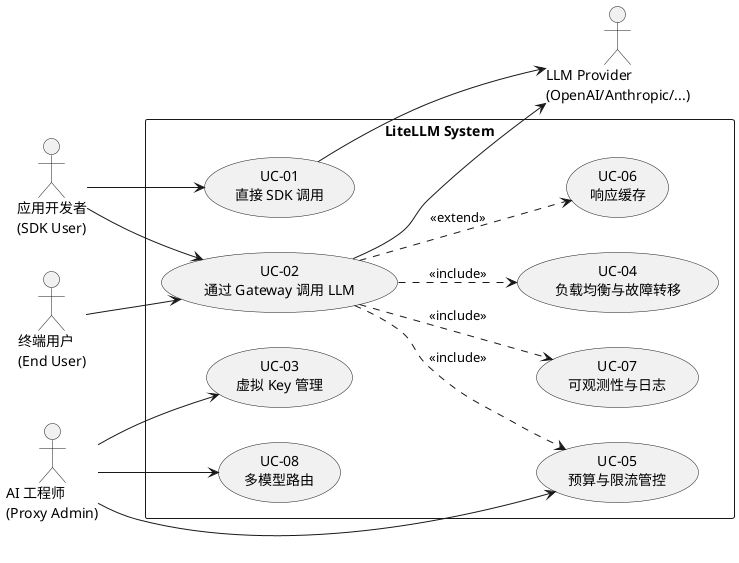
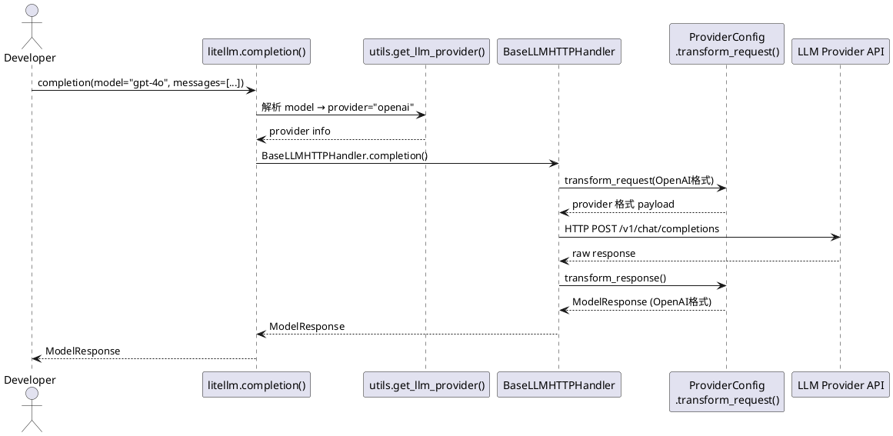
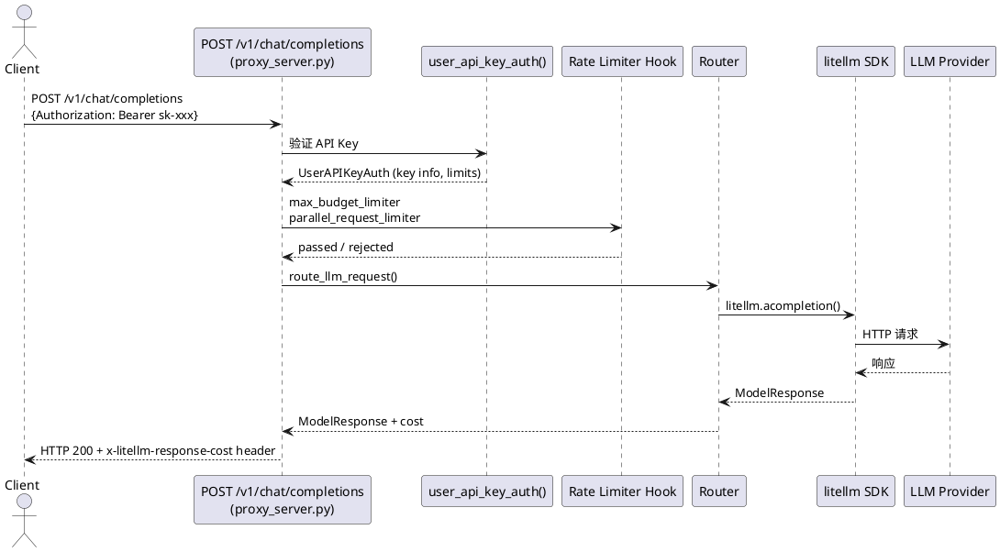
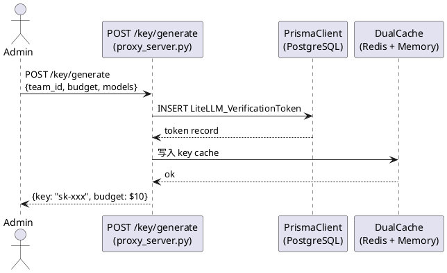
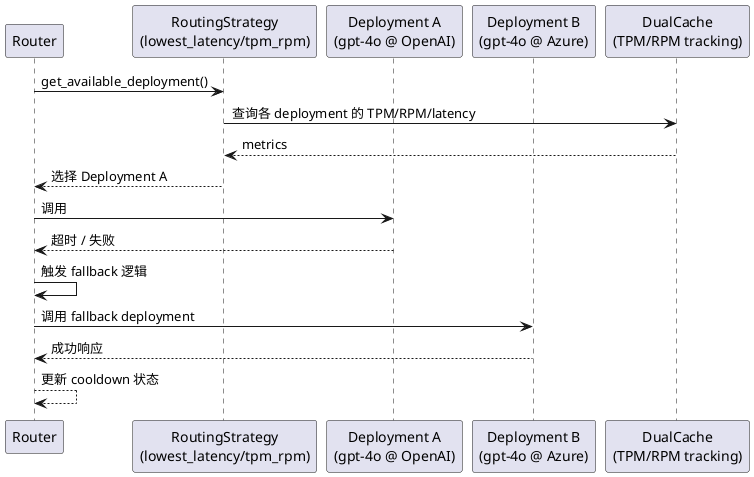
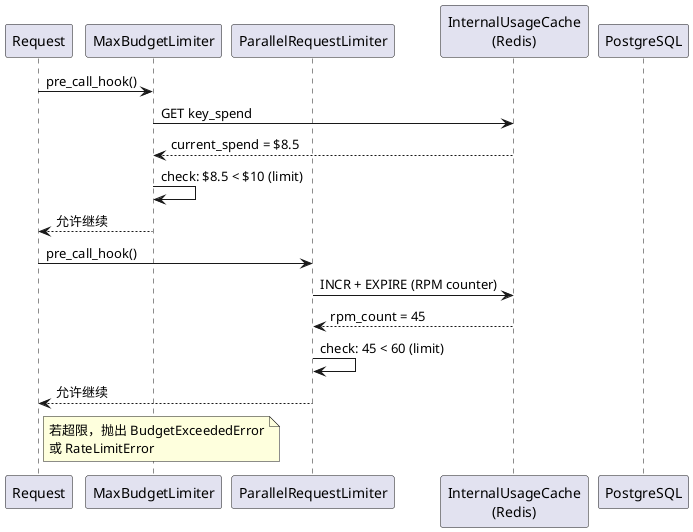
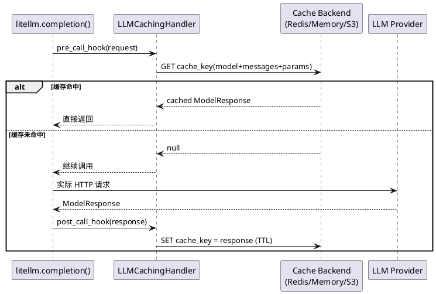
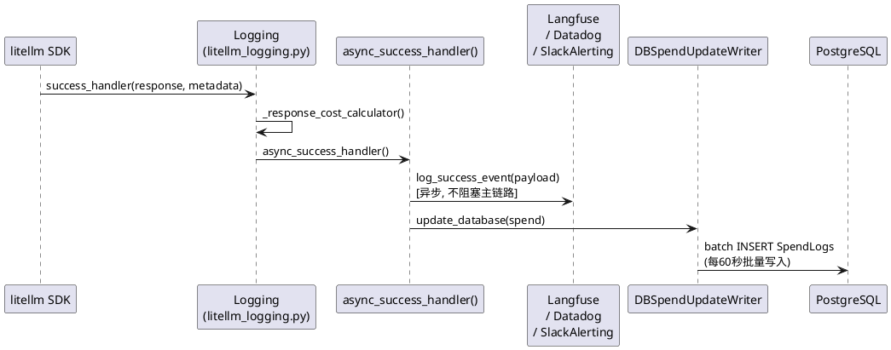

# 场景视图 (Scenarios / Use Cases — "+1")

> 场景视图是 4+1 架构中的驱动力。以下用例覆盖系统核心功能，并与其余四个视图形成追踪关系。

---

## 核心用例总览

---

## UC-01：直接 SDK 调用

**参与者**：应用开发者  
**目标**：用统一接口调用任意 LLM，无需关心 Provider 差异

**关联视图**：逻辑视图（SDK 核心类）、过程视图（SDK 请求序列）

---

## UC-02：通过 Gateway 调用 LLM

**参与者**：终端用户 / 应用开发者  
**目标**：通过 HTTP 调用 Gateway，享受认证、路由、计费等企业特性

**关联视图**：逻辑视图（Gateway 组件）、过程视图（Gateway 请求流）、物理视图（部署结构）

---

## UC-03：虚拟 Key 管理

**参与者**：AI 工程师（Admin）  
**目标**：创建/吊销虚拟 Key，绑定预算、模型权限和团队

---

## UC-04：负载均衡与故障转移

**参与者**：Router（自动）  
**目标**：跨多个 LLM 部署实例实现负载均衡，失败时自动 fallback

---

## UC-05：预算与限流管控

**参与者**：MaxBudgetLimiter Hook  
**目标**：实时阻断超过预算或速率限制的请求

---

## UC-06：响应缓存

**参与者**：LLMCachingHandler  
**目标**：对相同请求返回缓存响应，减少 LLM 调用成本

---

## UC-07：可观测性与日志

**参与者**：CustomLogger 集成（Langfuse、Datadog 等）  
**目标**：异步将调用详情、成本、tokens 推送到外部观测平台

