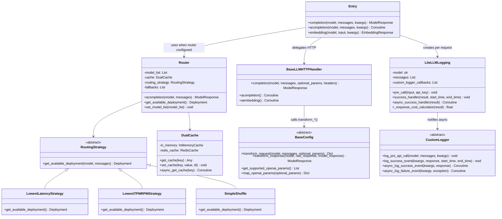
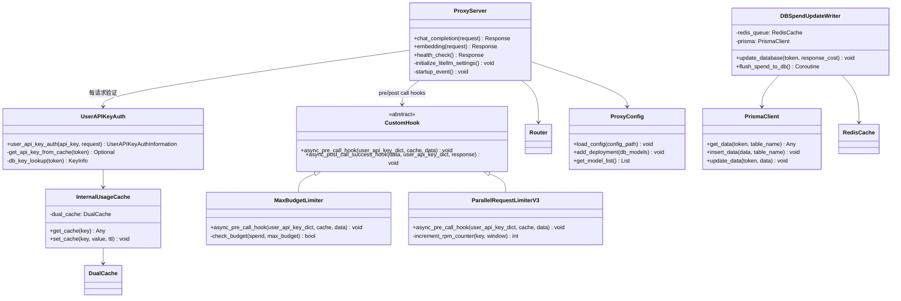
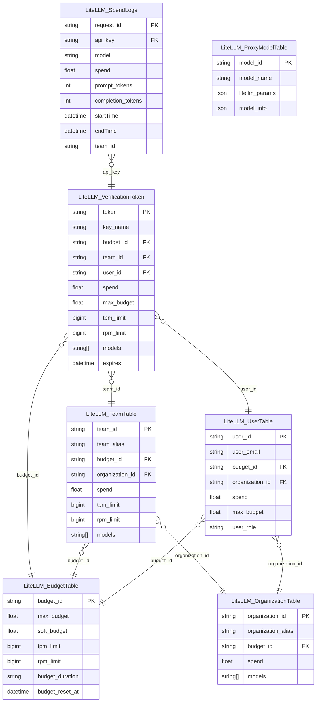
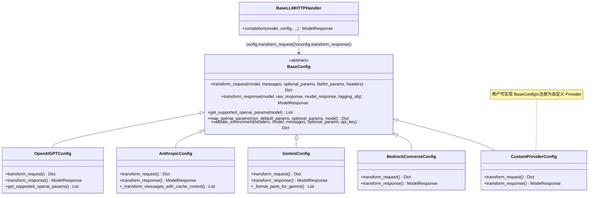

# 逻辑视图 (Logical View)

> 描述系统的核心抽象和功能分解，聚焦于类/接口的结构与关系，与部署/进程无关。

---

## 1. 顶层组件分解

```mermaid
flowchart TB
    subgraph Gateway["AI Gateway — proxy/"]
        PS["ProxyServer\nproxy_server.py"]
        Auth["AuthLayer\nauth/user_api_key_auth.py"]
        Hooks["ProxyHooks\nhooks/"]
        MgmtAPI["ManagementAPI\n/key  /team  /user"]
        Guard["GuardrailsEngine\nguardrails/"]
        DBWriter["DBSpendWriter\ndb/db_spend_update_writer.py"]
    end

    subgraph SDK["SDK Core — litellm/"]
        Entry["EntryPoints\nmain.py"]
        Router["Router\nrouter.py"]
        Resolver["ProviderResolver\nutils.get_llm_provider()"]
        HTTP["BaseLLMHTTPHandler\nllms/custom_httpx/llm_http_handler.py"]
        CacheH["LLMCachingHandler\ncaching/llm_caching_handler.py"]
        Cost["CostCalculator\ncost_calculator.py"]
        LogCore["LoggingCore\nlitellm_core_utils/litellm_logging.py"]
    end

    subgraph Providers["Provider Layer — llms/"]
        Base["BaseConfig (ABC)\nbase_llm/chat/transformation.py"]
        OAI["OpenAIConfig"]
        ANT["AnthropicConfig"]
        GEM["GeminiConfig"]
        BED["BedrockConfig"]
        AZ["AzureConfig"]
        More["100+ Providers ..."]
    end

    subgraph Integ["Integrations — integrations/"]
        CL["CustomLogger\ncustom_logger.py"]
        Langfuse["LangfuseLogger"]
        DD["DatadogLogger"]
        Slack["SlackAlerting"]
        PCT["ProxyCostTracker"]
    end

    subgraph Caching["Caching — caching/"]
        DC["DualCache\ndual_cache.py"]
        Redis["RedisCache\nredis_cache.py"]
        Mem["InMemoryCache"]
    end

    PS --> Auth
    PS --> Hooks
    PS --> Router
    PS --> MgmtAPI
    PS --> Guard

    Router --> Entry
    Router --> DC

    Entry --> Resolver
    Entry --> HTTP
    Entry --> LogCore
    Entry --> CacheH

    HTTP --> Base
    OAI & ANT & GEM & BED & AZ & More -->|extends| Base

    LogCore --> CL
    Langfuse & DD & Slack & PCT -->|extends| CL
    PCT --> DBWriter

    CacheH --> DC
    DC --> Redis
    DC --> Mem
```

---

## 2. SDK 核心类图

```mermaid
classDiagram
    class Entry {
        +completion(model, messages, kwargs) ModelResponse
        +acompletion(model, messages, kwargs) Coroutine
        +embedding(model, input, kwargs) EmbeddingResponse
    }

    class Router {
        -model_list: List
        -cache: DualCache
        -routing_strategy: RoutingStrategy
        -fallbacks: List
        +acompletion(model, messages) ModelResponse
        +get_available_deployment() Deployment
        +set_model_list(model_list) void
    }

    class RoutingStrategy {
        <<abstract>>
        +get_available_deployment(model, messages) Deployment
    }

    class LowestLatencyStrategy {
        +get_available_deployment() Deployment
    }

    class LowestTPMRPMStrategy {
        +get_available_deployment() Deployment
    }

    class SimpleShuffle {
        +get_available_deployment() Deployment
    }

    class BaseConfig {
        <<abstract>>
        +transform_request(model, messages, optional_params) Dict
        +transform_response(model, raw_response, model_response) ModelResponse
        +get_supported_openai_params() List
        +map_openai_params(optional_params) Dict
    }

    class BaseLLMHTTPHandler {
        +completion(model, messages, optional_params, headers) ModelResponse
        +acompletion() Coroutine
        +aembedding() Coroutine
    }

    class DualCache {
        -in_memory: InMemoryCache
        -redis_cache: RedisCache
        +get_cache(key) Any
        +set_cache(key, value, ttl) void
        +async_get_cache(key) Coroutine
    }

    class LiteLLMLogging {
        -model: str
        -messages: List
        -custom_logger_callbacks: List
        +pre_call(input, api_key) void
        +success_handler(result, start_time, end_time) void
        +async_success_handler(result) Coroutine
        +_response_cost_calculator(result) float
    }

    class CustomLogger {
        <<abstract>>
        +log_pre_api_call(model, messages, kwargs) void
        +log_success_event(kwargs, response, start_time, end_time) void
        +async_log_success_event(kwargs, response) Coroutine
        +async_log_failure_event(kwargs, exception) Coroutine
    }

    Entry --> Router : uses when router configured
    Entry --> BaseLLMHTTPHandler : delegates HTTP
    Entry --> LiteLLMLogging : creates per request

    Router --> RoutingStrategy
    Router --> DualCache
    RoutingStrategy <|-- LowestLatencyStrategy
    RoutingStrategy <|-- LowestTPMRPMStrategy
    RoutingStrategy <|-- SimpleShuffle

    BaseLLMHTTPHandler --> BaseConfig : calls transform_*()
    LiteLLMLogging --> CustomLogger : notifies async
```

---

## 3. Gateway (Proxy) 核心类图

```mermaid
classDiagram
    class ProxyServer {
        +chat_completion(request) Response
        +embedding(request) Response
        +health_check() Response
        -initialize_litellm_settings() void
        -startup_event() void
    }

    class UserAPIKeyAuth {
        +user_api_key_auth(api_key, request) UserAPIKeyAuthInformation
        -get_api_key_from_cache(token) Optional
        -db_key_lookup(token) KeyInfo
    }

    class InternalUsageCache {
        -dual_cache: DualCache
        +get_cache(key) Any
        +set_cache(key, value, ttl) void
    }

    class CustomHook {
        <<abstract>>
        +async_pre_call_hook(user_api_key_dict, cache, data) void
        +async_post_call_success_hook(data, user_api_key_dict, response) void
    }

    class MaxBudgetLimiter {
        +async_pre_call_hook(user_api_key_dict, cache, data) void
        -check_budget(spend, max_budget) bool
    }

    class ParallelRequestLimiterV3 {
        +async_pre_call_hook(user_api_key_dict, cache, data) void
        -increment_rpm_counter(key, window) int
    }

    class DBSpendUpdateWriter {
        -redis_queue: RedisCache
        -prisma: PrismaClient
        +update_database(token, response_cost) void
        +flush_spend_to_db() Coroutine
    }

    class PrismaClient {
        +get_data(token, table_name) Any
        +insert_data(data, table_name) void
        +update_data(token, data) void
    }

    class ProxyConfig {
        +load_config(config_path) void
        +add_deployment(db_models) void
        +get_model_list() List
    }

    ProxyServer --> UserAPIKeyAuth : 每请求验证
    ProxyServer --> CustomHook : pre/post call hooks
    ProxyServer --> Router
    ProxyServer --> ProxyConfig

    CustomHook <|-- MaxBudgetLimiter
    CustomHook <|-- ParallelRequestLimiterV3

    UserAPIKeyAuth --> InternalUsageCache
    InternalUsageCache --> DualCache

    DBSpendUpdateWriter --> PrismaClient
    DBSpendUpdateWriter --> RedisCache
```

---

## 4. 数据模型（核心实体 ER 图）

```mermaid
erDiagram
    LiteLLM_VerificationToken {
        string token PK
        string key_name
        string budget_id FK
        string team_id FK
        string user_id FK
        float spend
        float max_budget
        bigint tpm_limit
        bigint rpm_limit
        string[] models
        datetime expires
    }

    LiteLLM_TeamTable {
        string team_id PK
        string team_alias
        string budget_id FK
        string organization_id FK
        float spend
        bigint tpm_limit
        bigint rpm_limit
        string[] models
    }

    LiteLLM_UserTable {
        string user_id PK
        string user_email
        string budget_id FK
        string organization_id FK
        float spend
        float max_budget
        string user_role
    }

    LiteLLM_BudgetTable {
        string budget_id PK
        float max_budget
        float soft_budget
        bigint tpm_limit
        bigint rpm_limit
        string budget_duration
        datetime budget_reset_at
    }

    LiteLLM_SpendLogs {
        string request_id PK
        string api_key FK
        string model
        float spend
        int prompt_tokens
        int completion_tokens
        datetime startTime
        datetime endTime
        string team_id
    }

    LiteLLM_OrganizationTable {
        string organization_id PK
        string organization_alias
        string budget_id FK
        float spend
        string[] models
    }

    LiteLLM_ProxyModelTable {
        string model_id PK
        string model_name
        json litellm_params
        json model_info
    }

    LiteLLM_VerificationToken }o--|| LiteLLM_BudgetTable : "budget_id"
    LiteLLM_VerificationToken }o--|| LiteLLM_TeamTable : "team_id"
    LiteLLM_VerificationToken }o--|| LiteLLM_UserTable : "user_id"
    LiteLLM_TeamTable }o--|| LiteLLM_BudgetTable : "budget_id"
    LiteLLM_TeamTable }o--|| LiteLLM_OrganizationTable : "organization_id"
    LiteLLM_UserTable }o--|| LiteLLM_BudgetTable : "budget_id"
    LiteLLM_UserTable }o--|| LiteLLM_OrganizationTable : "organization_id"
    LiteLLM_SpendLogs }o--|| LiteLLM_VerificationToken : "api_key"
```

---

## 5. Provider 扩展架构

```mermaid
classDiagram
    class BaseConfig {
        <<abstract>>
        +transform_request(model, messages, optional_params, litellm_params, headers) Dict
        +transform_response(model, raw_response, model_response, logging_obj) ModelResponse
        +get_supported_openai_params(model) List
        +map_openai_params(non_default_params, optional_params, model) Dict
        +validate_environment(headers, model, messages, optional_params, api_key) Dict
    }

    class OpenAIGPTConfig {
        +transform_request() Dict
        +transform_response() ModelResponse
        +get_supported_openai_params() List
    }

    class AnthropicConfig {
        +transform_request() Dict
        +transform_response() ModelResponse
        +_transform_messages_with_cache_control() List
    }

    class GeminiConfig {
        +transform_request() Dict
        +transform_response() ModelResponse
        +_format_parts_for_gemini() List
    }

    class BedrockConverseConfig {
        +transform_request() Dict
        +transform_response() ModelResponse
    }

    class CustomProviderConfig {
        +transform_request() Dict
        +transform_response() ModelResponse
    }

    class BaseLLMHTTPHandler {
        +completion(model, config, ...) ModelResponse
    }

    BaseConfig <|-- OpenAIGPTConfig
    BaseConfig <|-- AnthropicConfig
    BaseConfig <|-- GeminiConfig
    BaseConfig <|-- BedrockConverseConfig
    BaseConfig <|-- CustomProviderConfig

    BaseLLMHTTPHandler --> BaseConfig : config.transform_request()\nconfig.transform_response()

    note for CustomProviderConfig "用户可实现 BaseConfig\n注册为自定义 Provider"
```
