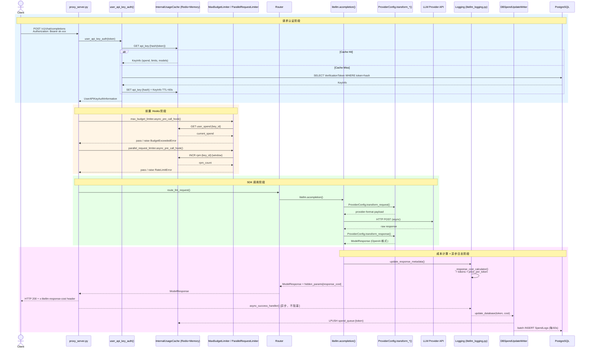
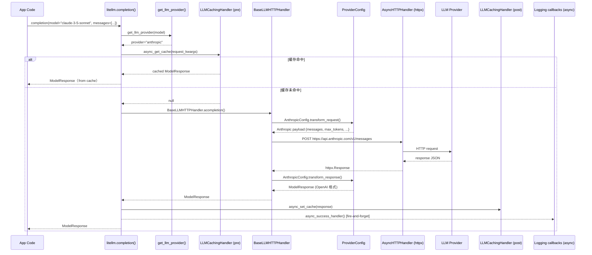
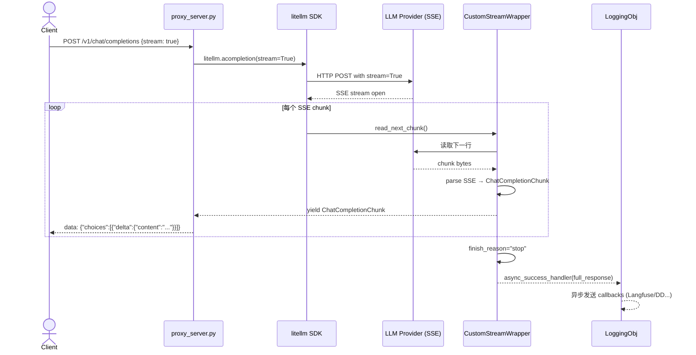
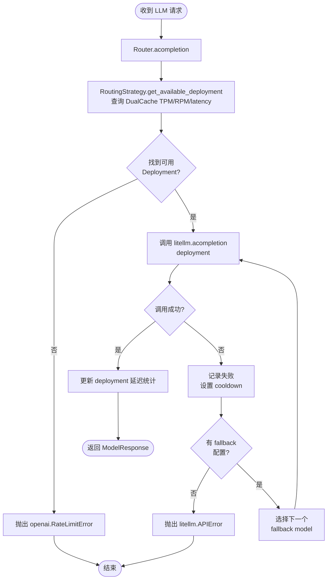
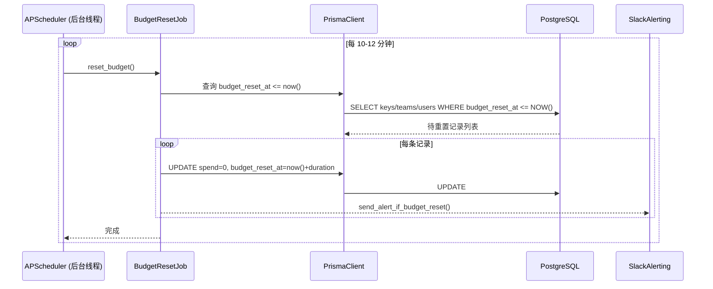
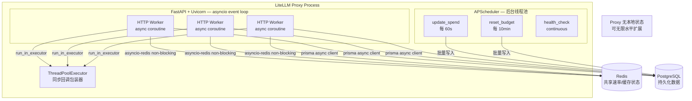

# 过程视图 (Process View)

> 描述系统运行时的并发结构、进程/线程模型、异步流程与交互序列。

---

## 1. Gateway 完整请求流程

---

## 2. SDK 直接调用流程

---

## 3. 流式响应处理流程

---

## 4. 路由器故障转移流程

---

## 5. 预算重置后台 Job

---

## 6. 并发模型概览

