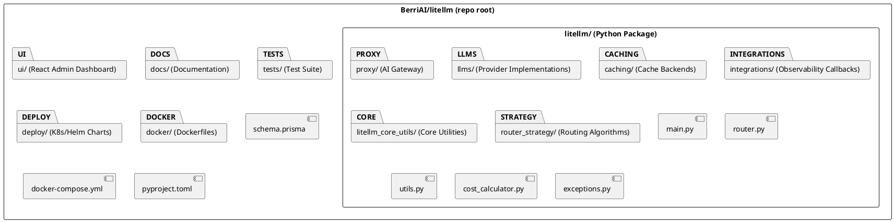
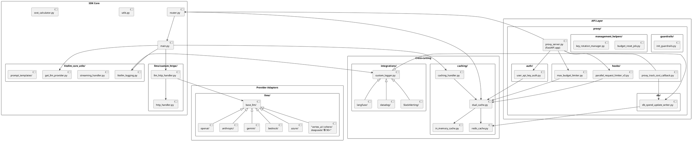

# 开发视图 (Development View)

> 描述代码的模块组织、包依赖关系和开发层次，帮助开发者理解代码结构、找到修改点。

---

## 1. 顶层目录结构



---

## 2. 模块层次与依赖关系



---

## 3. `litellm/proxy/` 内部模块图

```plantuml
@startuml Dev-Proxy-Detail
skinparam packageStyle rectangle

package "proxy/" {
  [proxy_server.py] as PS #lightblue
  note right of PS : FastAPI 主应用\n定义所有 API 路由

  package "auth/" {
    [user_api_key_auth.py] as UAKA
    [handle_jwt.py] as JWT
    [oauth2_check.py] as OAUTH
    [route_checks.py] as RC
    [auth_checks.py] as AC
  }

  package "hooks/" {
    [max_budget_limiter.py] as MBL
    [parallel_request_limiter_v3.py] as PRL
    [proxy_track_cost_callback.py] as PTCC
    [cache_control_check.py] as CCC
  }

  package "db/" {
    [db_spend_update_writer.py] as DBW
    [create_views.py] as CV
  }

  package "guardrails/" {
    [init_guardrails.py] as IG
    [guardrail_initializers.py] as GI
    [guardrail_hooks/] as GH
  }

  package "management_helpers/" {
    [budget_reset_job.py] as BRJ
    [key_rotation_manager.py] as KRM
    [spend_log_cleanup.py] as SLC
  }

  package "Endpoint Packages" {
    [anthropic_endpoints/] as AEP
    [vertex_ai_endpoints/] as VAP
    [image_endpoints/] as IEP
    [batches_endpoints/] as BEP
    [fine_tuning_endpoints/] as FEP
    [pass_through_endpoints/] as PEP
    [response_api_endpoints/] as RAP
    [agent_endpoints/] as AGEP
  }

  package "config_management_endpoints/" {
    [config_management.py] as CM
  }

  [_types.py] as TYPES
  [utils.py] as PUTILS
  [common_request_processing.py] as CRP
  [health_check.py] as HC

  PS --> UAKA
  PS --> MBL
  PS --> PRL
  PS --> CRP
  PS --> HC
  PS --> CM

  UAKA --> JWT
  UAKA --> OAUTH
  UAKA --> RC
  UAKA --> AC

  MBL --> DBW
  PRL --> DBW
  PTCC --> DBW

  IG --> GI
  GI --> GH
}
@enduml
```



---

## 4. `litellm/llms/` Provider 组织结构

```plantuml
@startuml Dev-LLMs-Structure

package "llms/ (Provider Adapters)" {
  package "base_llm/ (Abstract Base)" {
    [base_llm/chat/transformation.py\nBaseConfig (ABC)] as BASE
    [base_llm/embedding/transformation.py\nBaseEmbeddingConfig] as EMBASE
    [base_llm/audio_transcription/\nBaseAudioTranscriptionConfig] as AUDBASE
  }

  package "custom_httpx/ (HTTP Orchestrator)" {
    [llm_http_handler.py\nBaseLLMHTTPHandler] as HTTPH
    [http_handler.py\nHTTPHandler + AsyncHTTPHandler] as HTTP
  }

  package "openai/ (OpenAI + Compatible)" {
    [chat/gpt_transformation.py\nOpenAIGPTConfig] as OAI_CHAT
    [embedding/transformation.py] as OAI_EMB
  }

  package "anthropic/ (Anthropic)" {
    [chat/transformation.py\nAnthropicConfig] as ANT_CHAT
    [experimental_pass_through/] as ANT_PT
  }

  package "gemini/ (Google AI Studio)" {
    [chat/transformation.py\nGeminiConfig] as GEM_CHAT
  }

  package "bedrock/ (AWS Bedrock)" {
    [chat/converse_transformation.py\nBedrockConverseConfig] as BED_CONV
    [chat/invoke_transformations/\nanthropic_claude3_transformation.py] as BED_INV
    [messages/] as BED_MSG
  }

  package "vertex_ai/ (Google Vertex)" {
    [gemini/transformation.py] as VERT_GEM
    [vertex_ai_partner_models/anthropic/] as VERT_ANT
  }

  package "azure/ (Azure OpenAI)" {
    [chat/transformation.py\nAzureOpenAIConfig] as AZ_CHAT
  }

  package "cohere/ deepseek/ mistral/\nand 90+ more providers" as MORE {
  }
}

BASE <|-- OAI_CHAT
BASE <|-- ANT_CHAT
BASE <|-- GEM_CHAT
BASE <|-- BED_CONV
BASE <|-- BED_INV
BASE <|-- VERT_GEM
BASE <|-- AZ_CHAT
BASE <|-- MORE

HTTPH --> BASE : calls transform_*()
HTTPH --> HTTP : HTTP client
@enduml
```



---

## 5. 测试模块结构

```plantuml
@startuml Dev-Tests

package "tests/" {
  package "llm_translation/ (Unit Tests)" {
    [test_openai_translation.py] as T1
    [test_anthropic_translation.py] as T2
    [test_bedrock_translation.py] as T3
    [test_gemini_translation.py] as T4
    [test_vertex_translation.py] as T5
  }

  package "proxy_unit_tests/ (Gateway Unit Tests)" {
    [test_auth.py] as TA
    [test_budget_limiter.py] as TBL
    [test_parallel_request_limiter.py] as TPRL
    [test_router.py] as TR
  }

  package "load_tests/ (Performance Tests)" {
    [test_load.py] as TL
  }

  package "test_amazing_proxy_custom_logger/ (Integration)" {
    [test_custom_logger.py] as TCL
  }
}

note bottom of "llm_translation/"
  Translation tests 不需要真实 API Key
  直接 instantiate ProviderConfig 测试 transform_*()
end note

note bottom of "proxy_unit_tests/"
  Gateway 测试使用 TestClient (FastAPI)
  Mock Redis + Prisma
end note
@enduml
```

---

## 6. 关键文件快速索引

| 场景 | 文件路径 |
|------|----------|
| 新增 LLM Provider | `litellm/llms/{provider}/chat/transformation.py` |
| 新增 Proxy Hook | `litellm/proxy/hooks/` + 注册到 `PROXY_HOOKS` |
| 修改请求路由逻辑 | `litellm/router.py` |
| 新增路由策略 | `litellm/router_strategy/{strategy}.py` |
| 修改 API Key 认证 | `litellm/proxy/auth/user_api_key_auth.py` |
| 修改成本计算 | `litellm/cost_calculator.py` |
| 修改 DB Schema | `schema.prisma` |
| 新增 API 端点 | `litellm/proxy/proxy_server.py` |
| 新增可观测集成 | `litellm/integrations/{service}/` (继承 `CustomLogger`) |
| 修改缓存逻辑 | `litellm/caching/caching_handler.py` |
| 流式响应处理 | `litellm/litellm_core_utils/streaming_handler.py` |
