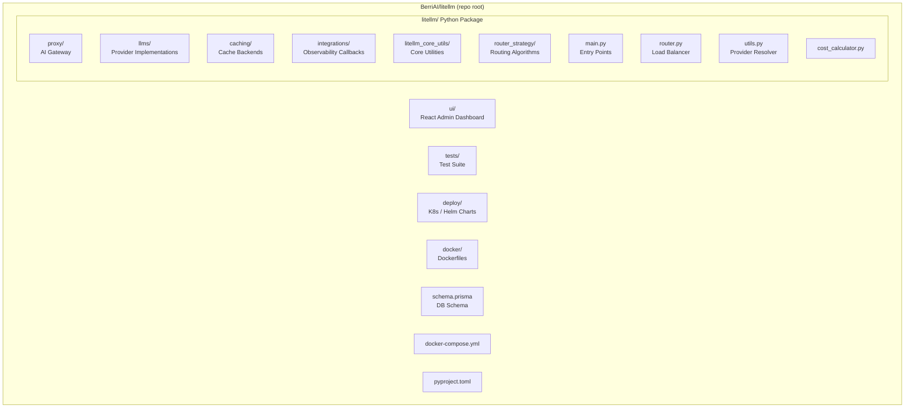
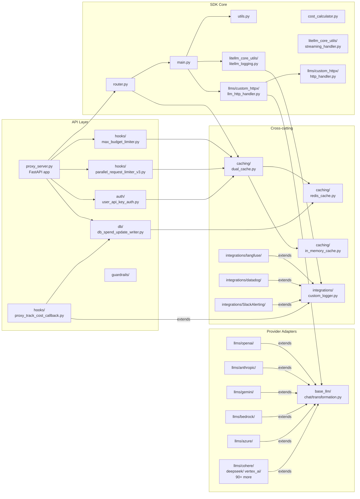
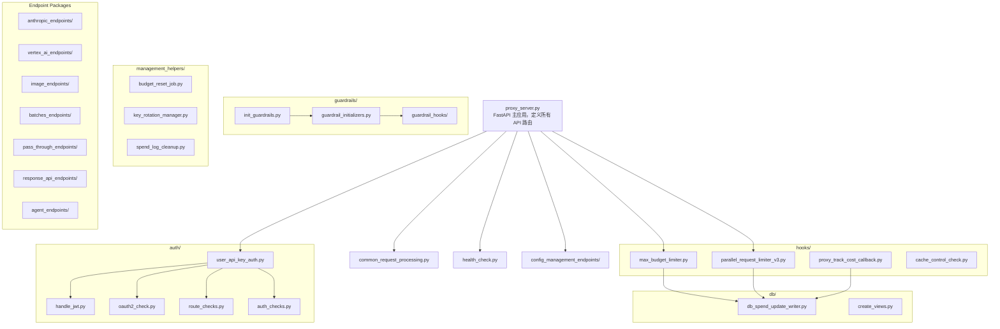
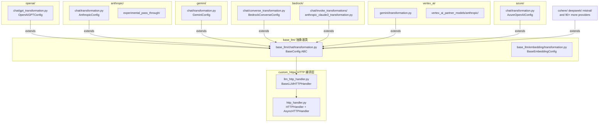
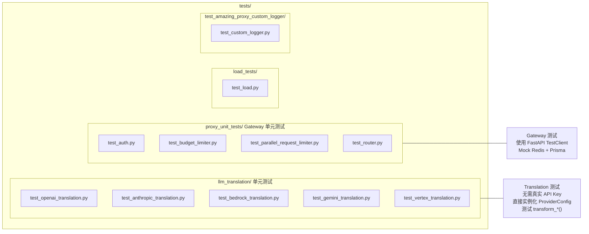

# 开发视图 (Development View)

> 描述代码的模块组织、包依赖关系和开发层次，帮助开发者理解代码结构、找到修改点。

---

## 1. 顶层目录结构

---

## 2. 模块层次与依赖关系

---

## 3. `litellm/proxy/` 内部模块图

---

## 4. `litellm/llms/` Provider 组织结构

---

## 5. 测试模块结构

---

## 6. 关键文件快速索引

| 场景 | 文件路径 |
|------|----------|
| 新增 LLM Provider | `litellm/llms/{provider}/chat/transformation.py` |
| 新增 Proxy Hook | `litellm/proxy/hooks/` + 注册到 `PROXY_HOOKS` |
| 修改请求路由逻辑 | `litellm/router.py` |
| 新增路由策略 | `litellm/router_strategy/{strategy}.py` |
| 修改 API Key 认证 | `litellm/proxy/auth/user_api_key_auth.py` |
| 修改成本计算 | `litellm/cost_calculator.py` |
| 修改 DB Schema | `schema.prisma` |
| 新增 API 端点 | `litellm/proxy/proxy_server.py` |
| 新增可观测集成 | `litellm/integrations/{service}/`（继承 `CustomLogger`） |
| 修改缓存逻辑 | `litellm/caching/caching_handler.py` |
| 流式响应处理 | `litellm/litellm_core_utils/streaming_handler.py` |
