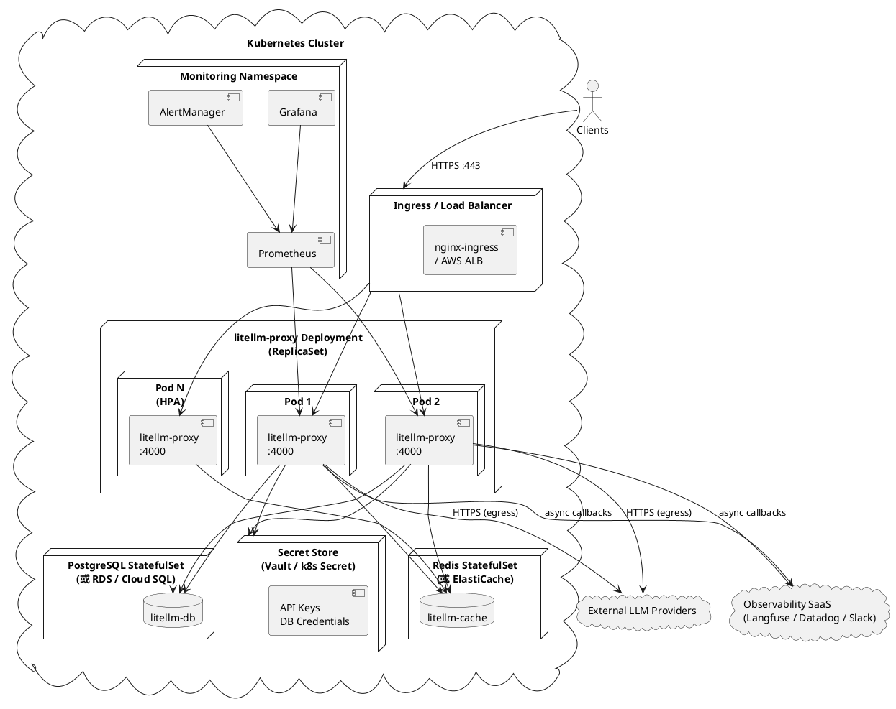
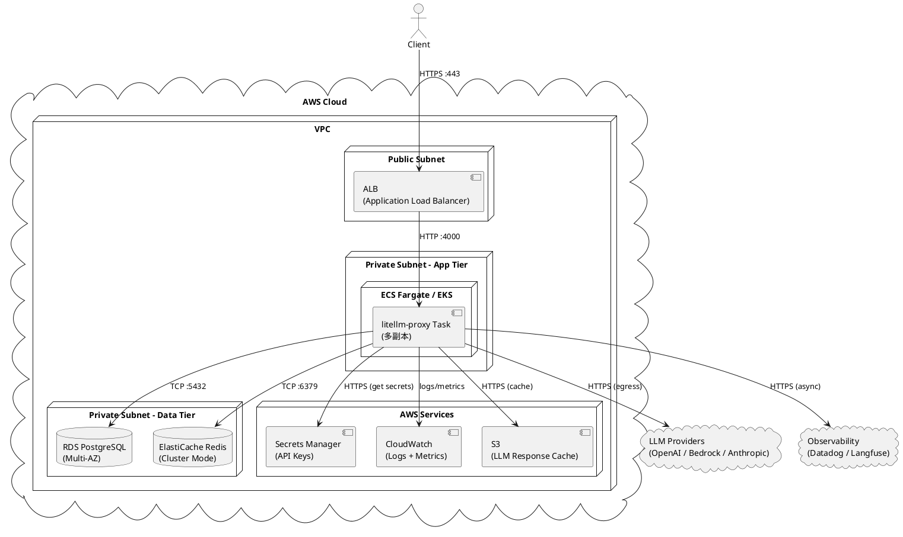
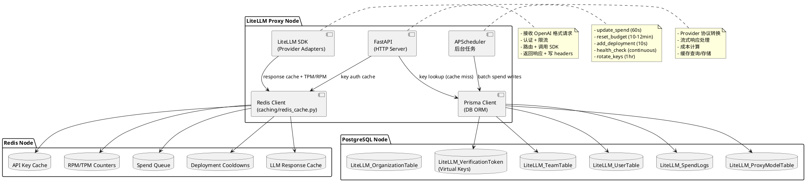
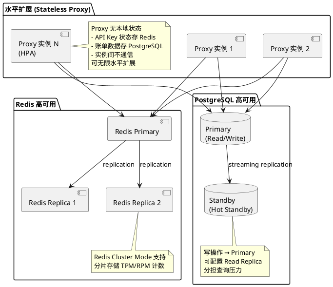

# 物理视图 (Physical / Deployment View)

> 描述系统在基础设施上的部署拓扑、节点分配、网络结构和运维特性。

---

## 1. 标准 Docker Compose 部署

> 适用于单机自托管场景（小团队 / 快速启动）

```plantuml
@startuml Physical-DockerCompose
skinparam nodeStyle rectangle

node "Docker Host (单机)" {

  node "litellm Container\n:4000" as LC {
    component "FastAPI + Uvicorn\n(proxy_server.py)" as API
    component "APScheduler\n(后台 Jobs)" as SCHED
    component "LiteLLM SDK\n(litellm/)" as SDK
  }

  node "PostgreSQL Container\n:5432" as PG {
    database "litellm DB\n(keys, teams, spend_logs)" as PGDB
  }

  node "Prometheus Container\n:9090" as PROM {
    component "Metrics Scraper" as MS
  }

  volume "postgres_data" as PGVOL
  volume "prometheus_data" as PROMVOL
}

cloud "External LLM Providers" as PROVIDERS {
  component "OpenAI API"
  component "Anthropic API"
  component "Bedrock / Vertex AI"
  component "Azure OpenAI"
}

cloud "Optional Redis\n(External)" as REDIS

actor "Client App" as CLIENT
actor "Admin UI" as ADMIN_UI

CLIENT --> LC : HTTP :4000\n/v1/chat/completions
ADMIN_UI --> LC : HTTP :4000\n/ui (React SPA)
LC --> PG : TCP :5432\nPrisma Client
LC --> REDIS : TCP :6379\n(Redis optional)
LC --> PROVIDERS : HTTPS (outbound)
PROM --> LC : GET :4000/metrics
PG --> PGVOL
PROM --> PROMVOL
@enduml
```

---

## 2. Kubernetes 生产部署

> 适用于企业级高可用场景



---

## 3. 云托管架构（AWS 参考）



---

## 4. 节点职责说明



---

## 5. 网络流量与端口

| 方向 | 源 | 目标 | 端口 | 协议 | 说明 |
|------|-----|------|------|------|------|
| Inbound | Client | LiteLLM Proxy | 4000 | HTTP/HTTPS | API 请求 |
| Inbound | Admin Browser | LiteLLM Proxy | 4000/ui | HTTP/HTTPS | 管理 UI |
| Inbound | Prometheus | LiteLLM Proxy | 4000/metrics | HTTP | 指标采集 |
| Outbound | LiteLLM Proxy | PostgreSQL | 5432 | TCP | 持久化 |
| Outbound | LiteLLM Proxy | Redis | 6379 | TCP | 缓存/队列 |
| Outbound | LiteLLM Proxy | OpenAI API | 443 | HTTPS | LLM 调用 |
| Outbound | LiteLLM Proxy | Anthropic API | 443 | HTTPS | LLM 调用 |
| Outbound | LiteLLM Proxy | AWS Bedrock | 443 | HTTPS | LLM 调用 |
| Outbound | LiteLLM Proxy | Langfuse/Datadog | 443 | HTTPS | 异步日志 |

---

## 6. 扩展性与容灾特性


