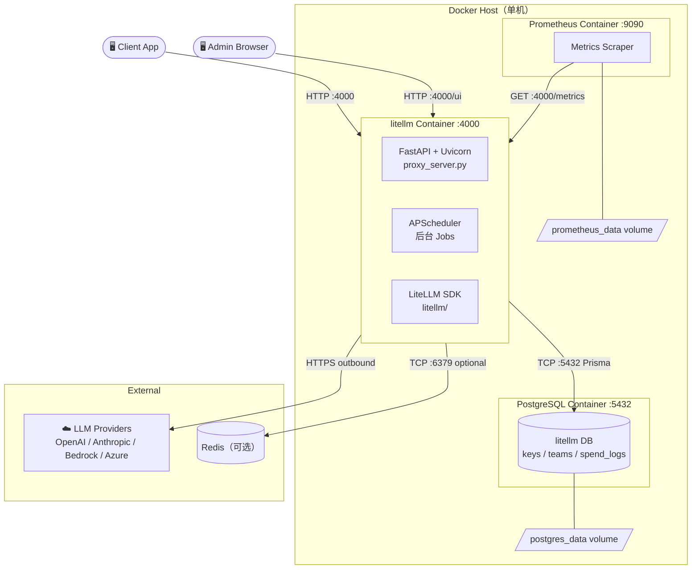
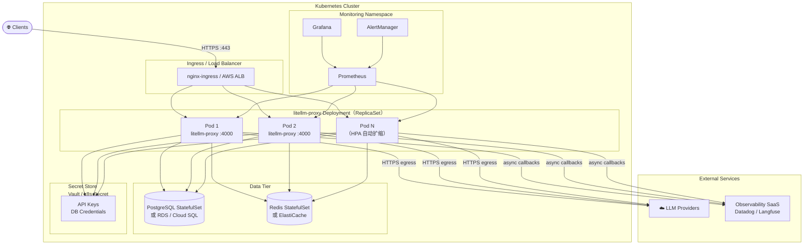
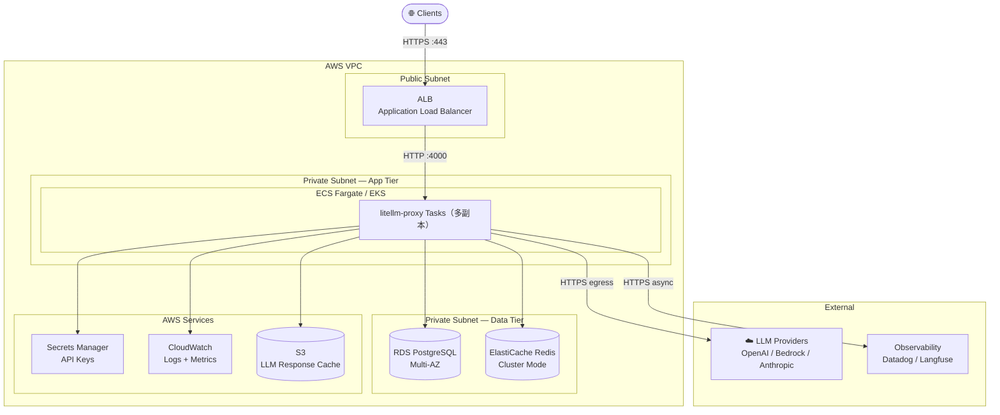
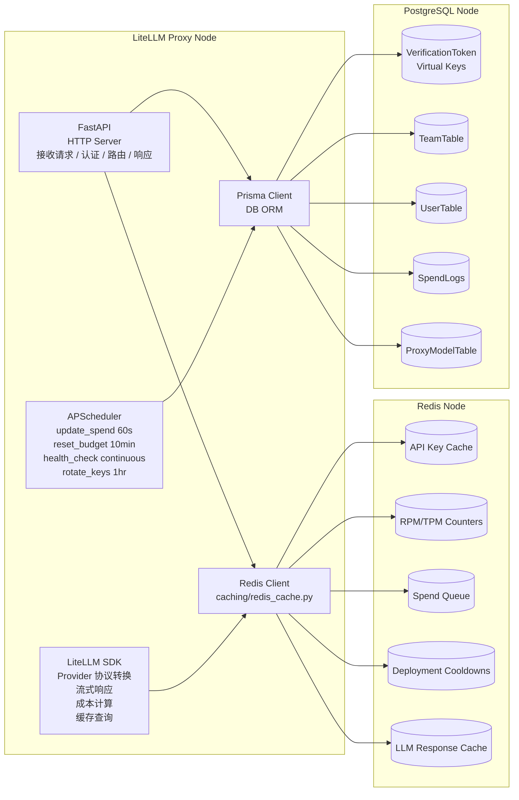
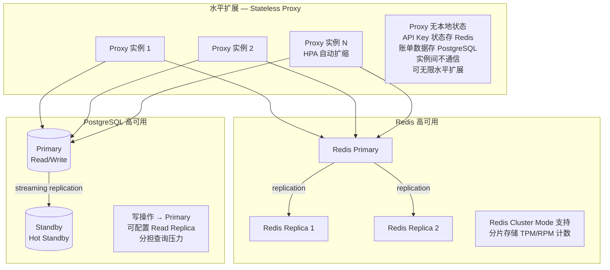

# 物理视图 (Physical / Deployment View)

> 描述系统在基础设施上的部署拓扑、节点分配、网络结构和运维特性。

---

## 1. 标准 Docker Compose 部署

> 适用于单机自托管场景（小团队 / 快速启动）

---

## 2. Kubernetes 生产部署

> 适用于企业级高可用场景

---

## 3. AWS 云托管架构

---

## 4. 节点职责与内部组件

---

## 5. 网络流量与端口

| 方向 | 源 | 目标 | 端口 | 协议 | 说明 |
|------|-----|------|------|------|------|
| Inbound | Client App | LiteLLM Proxy | 4000 | HTTP/HTTPS | API 请求 |
| Inbound | Admin Browser | LiteLLM Proxy | 4000/ui | HTTP/HTTPS | 管理 UI |
| Inbound | Prometheus | LiteLLM Proxy | 4000/metrics | HTTP | 指标采集 |
| Outbound | LiteLLM Proxy | PostgreSQL | 5432 | TCP | 持久化 |
| Outbound | LiteLLM Proxy | Redis | 6379 | TCP | 缓存/队列 |
| Outbound | LiteLLM Proxy | OpenAI API | 443 | HTTPS | LLM 调用 |
| Outbound | LiteLLM Proxy | Anthropic API | 443 | HTTPS | LLM 调用 |
| Outbound | LiteLLM Proxy | AWS Bedrock | 443 | HTTPS | LLM 调用 |
| Outbound | LiteLLM Proxy | Langfuse/Datadog | 443 | HTTPS | 异步日志 |

---

## 6. 扩展性与高可用设计

