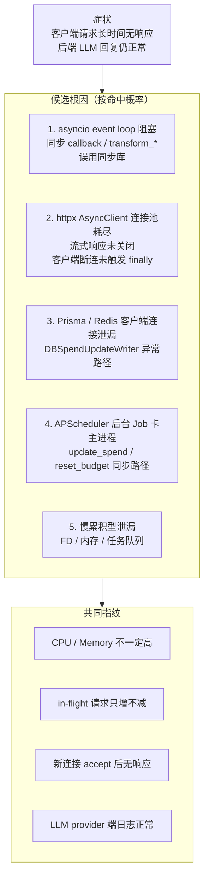
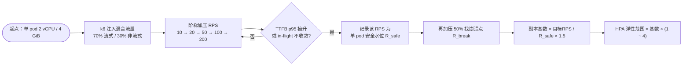
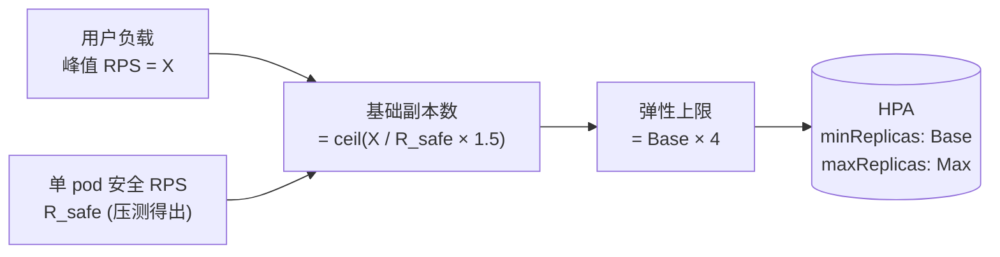
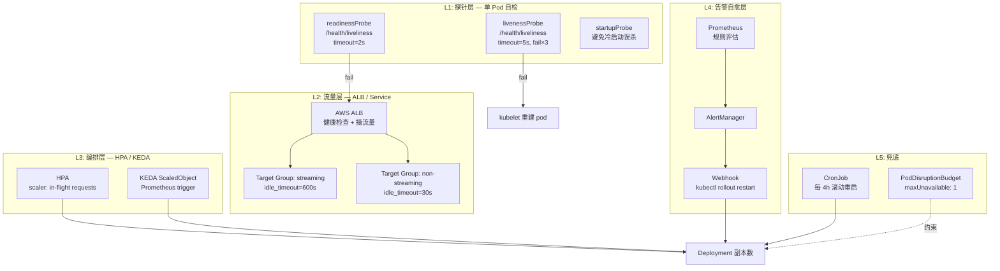
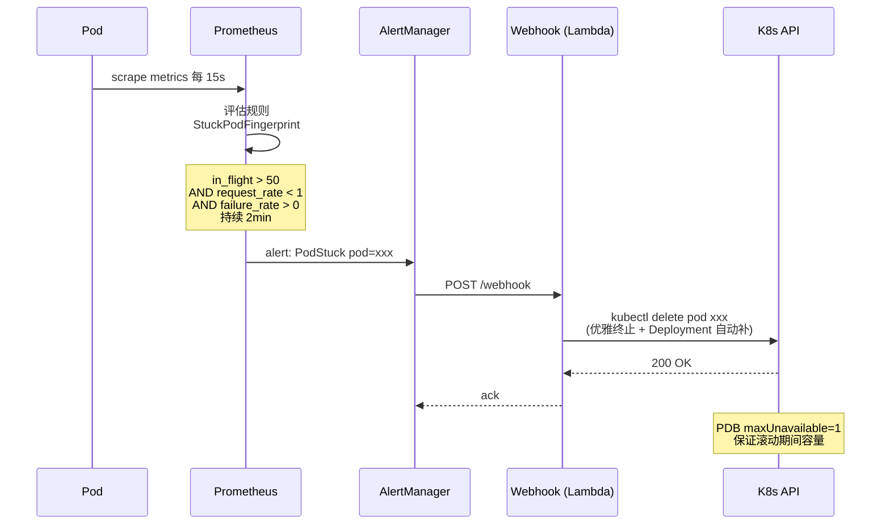
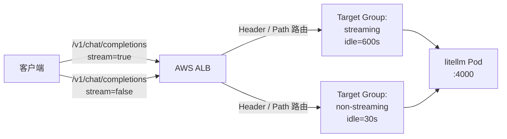
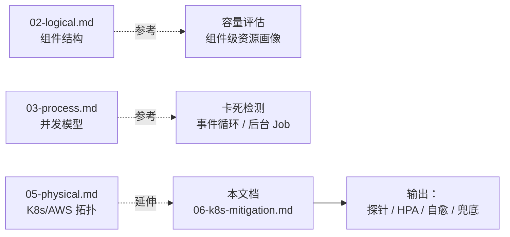

# AWS / K8s 部署下的应急缓解方案

> 场景：LiteLLM Proxy 运行一段时间后，**部分客户端请求不再响应**，但后端 LLM 调用本身正常返回。
> 目标：根因尚未定位前，通过容量评估 + 自动检测 + 自动处置，把用户影响压到最低。
>
> 本文档是对 [05-physical.md](05-physical.md) 的延伸，聚焦"卡死"类故障在 AWS/EKS 上的应急运维设计。

---

## 1. 故障特征与候选根因



**关键判断**：CPU 与内存不能作为扩容/告警的唯一信号——卡死状态下两者可能都很低。必须依赖**业务并发指标**与**事件循环健康度**。

---

## 2. 容量评估方法

### 2.1 必须采集的关键指标

| 维度 | 指标 (Prometheus) | 来源 | 告警阈值 |
|------|------------------|------|---------|
| 并发 | `litellm_proxy_total_requests_in_flight` | LiteLLM 内置 | > 单 pod 200 |
| 延迟 | `litellm_request_total_latency_seconds` (p95) | LiteLLM 内置 | > 2s 持续 1min |
| TTFB | `litellm_llm_api_time_to_first_token_seconds` | LiteLLM 内置 | > 1s p95 |
| 事件循环 | `python_asyncio_loop_lag_seconds` | 自埋点 | > 0.1s |
| 连接池 | `httpx_pool_connections` | 自埋点 | > 80% 容量 |
| FD | `process_open_fds` / `process_max_fds` | Python client | > 80% |
| 进程 | `process_resident_memory_bytes` | Python client | > 80% limit |
| DB | Prisma pool wait | 自埋点 | > 50ms |

事件循环 lag 的最简埋点（每秒 schedule 一次自身，记录漂移）：

```python
import asyncio, time
from prometheus_client import Gauge

LOOP_LAG = Gauge("python_asyncio_loop_lag_seconds", "asyncio event loop lag")

async def loop_watchdog():
    while True:
        t = time.perf_counter()
        await asyncio.sleep(1.0)
        LOOP_LAG.set((time.perf_counter() - t) - 1.0)
```

### 2.2 容量摸底流程



> 必做：测试集中要包含**长上下文 + 流式 + 客户端中途断连**，这正是触发"卡死"的关键路径。

### 2.3 单 Pod 资源配额建议

```yaml
resources:
  requests:
    cpu: "1"           # 稳态 70% 使用率为目标
    memory: "2Gi"
  limits:
    cpu: "2"           # Burst 头给到 2x，但避免 4x+（GIL 用不完）
    memory: "4Gi"      # OOMKill 比换页友善

# 关键：单进程，多 pod
# 不要在同一 pod 跑 multiple uvicorn workers——
# APScheduler 会被多次启动，update_spend 出现重复写入。
env:
  - name: NUM_WORKERS
    value: "1"
```

### 2.4 用户负载映射



经验值（仅参考，需以实测为准）：
- 单 pod 2 vCPU / 4 GiB：50–100 RPS（混合负载）
- 1k RPS 集群：基础副本 15–20，弹性上限 60–80
- Redis：流量 × 5（每请求约 5 次缓存交互）
- PostgreSQL：连接数 = 总 pod 数 × Prisma pool size（默认 10）

---

## 3. 检测与自愈架构



### 3.1 探针配置

```yaml
# 关键：用 /health/liveliness（穿过 FastAPI event loop），
# 不要用 /health/readiness（会去 ping 所有 LLM provider）
readinessProbe:
  httpGet:
    path: /health/liveliness
    port: 4000
  periodSeconds: 5
  timeoutSeconds: 2
  failureThreshold: 2          # 失败即摘流量
  successThreshold: 1

livenessProbe:
  httpGet:
    path: /health/liveliness
    port: 4000
  periodSeconds: 10
  timeoutSeconds: 5
  failureThreshold: 3          # 30s 无响应才重建
  initialDelaySeconds: 60      # 避开冷启动

startupProbe:
  httpGet:
    path: /health/liveliness
    port: 4000
  periodSeconds: 5
  failureThreshold: 24         # 容忍 2min 启动
```

**为什么这能抓"卡死"**：事件循环阻塞时，`/health/liveliness` 也无法返回——探针超时就是最直接的指纹。

> 注意：**不要用 `/health/readiness`** 当 readinessProbe，它会同步 ping 所有 provider，provider 抖动会误把所有 pod 摘掉。

### 3.2 HPA — 必须用业务并发指标

```yaml
# 推荐 KEDA + Prometheus（HPA 原生 custom metrics 也可）
apiVersion: keda.sh/v1alpha1
kind: ScaledObject
metadata:
  name: litellm-proxy
spec:
  scaleTargetRef:
    name: litellm-proxy
  minReplicaCount: 6
  maxReplicaCount: 40
  cooldownPeriod: 300          # 缩容慢一点
  triggers:
  - type: prometheus
    metadata:
      serverAddress: http://prometheus:9090
      metricName: in_flight_per_pod
      threshold: "100"
      query: |
        avg(litellm_proxy_total_requests_in_flight)
          / count(up{job="litellm-proxy"})
  - type: prometheus
    metadata:
      metricName: ttfb_p95
      threshold: "2"
      query: |
        histogram_quantile(0.95,
          rate(litellm_request_total_latency_seconds_bucket[2m]))
```

**绝对不要用 CPU 做扩容触发**：卡死状态下 CPU 接近 0，HPA 看到"很闲"不扩容，灾难放大。

### 3.3 自愈触发链



PromQL 卡死指纹规则：

```yaml
groups:
- name: litellm-stuck
  rules:
  - alert: LiteLLMPodStuck
    expr: |
      (
        avg_over_time(litellm_proxy_total_requests_in_flight[2m]) > 50
        and on(pod) rate(http_requests_total[2m]) < 1
        and on(pod) rate(litellm_proxy_failed_requests_total[2m]) > 0
      )
      or
      (
        avg_over_time(python_asyncio_loop_lag_seconds[1m]) > 0.5
      )
    for: 2m
    labels:
      severity: critical
      action: restart_pod
    annotations:
      summary: "Pod {{ $labels.pod }} appears stuck (in-flight high, throughput zero)"
```

### 3.4 兜底：定时滚动

```yaml
apiVersion: batch/v1
kind: CronJob
metadata:
  name: litellm-rolling-restart
spec:
  schedule: "0 */4 * * *"     # 每 4 小时
  jobTemplate:
    spec:
      template:
        spec:
          serviceAccountName: litellm-restarter
          containers:
          - name: kubectl
            image: bitnami/kubectl
            command:
            - kubectl
            - rollout
            - restart
            - deployment/litellm-proxy
          restartPolicy: OnFailure
```

配合：
```yaml
apiVersion: policy/v1
kind: PodDisruptionBudget
metadata:
  name: litellm-proxy
spec:
  maxUnavailable: 1
  selector:
    matchLabels:
      app: litellm-proxy
---
spec:
  strategy:
    type: RollingUpdate
    rollingUpdate:
      maxSurge: 25%
      maxUnavailable: 0      # 滚动期间不减容量
```

---

## 4. ALB 与超时分层



- **流式**与**非流式**走不同 target group，避免 600s idle_timeout 让卡死的非流式请求一直挂着。
- ALB 健康检查走 `/health/liveliness`，与 readinessProbe 同语义但路径独立。
- 客户端 SDK 侧建议 timeout = 60s + 重试 + 指数退避 + jitter（关键：jitter 避免重启瞬间惊群）。

---

## 5. 实施 Checklist 与优先级

```mermaid
flowchart TB
    P0["P0 — 24h 内"]
    P1["P1 — 1 周内"]
    P2["P2 — 2 周内"]

    P0 --> P0_1[配置 readiness/liveness<br/>用 /health/liveliness]
    P0 --> P0_2[CronJob 每 4h 滚动重启]
    P0 --> P0_3[PDB maxUnavailable=1]
    P0 --> P0_4[ALB idle_timeout 分层]

    P1 --> P1_1[Prometheus + LiteLLM<br/>internal metrics]
    P1 --> P1_2[KEDA HPA 用 in-flight 指标]
    P1 --> P1_3[event loop lag 自埋点]
    P1 --> P1_4[卡死指纹告警 + Webhook 自愈]

    P2 --> P2_1[k6 压测建立 R_safe]
    P2 --> P2_2[Streaming/non-streaming<br/>target group 拆分]
    P2 --> P2_3[Grafana 看板 + 容量基线]
    P2 --> P2_4[根因排查：<br/>asyncio 阻塞探针 / py-spy]
```



### P0（先止血，今天就能上）
1. **探针就位**：readiness + liveness 都用 `/health/liveliness`
2. **定时滚动**：CronJob 每 4 小时 `rollout restart`
3. **PDB**：`maxUnavailable: 1`
4. **超时分层**：ALB 流式 / 非流式分 target group

### P1（一周内补足检测能力）
1. 接入 LiteLLM Prometheus 指标 + `python_asyncio_loop_lag_seconds` 自埋点
2. KEDA 用 `in-flight per pod` + `TTFB p95` 触发扩容
3. AlertManager + 自愈 Webhook 联动卡死指纹

### P2（深入根因 + 长效）
1. k6 压测建立 R_safe 与 R_break
2. 跑 `py-spy dump` / `aiomonitor` 定位事件循环阻塞点
3. 同步分析 httpx pool / Prisma pool 用量曲线

---

## 6. 与现有 4+1 视图的关系



本文档是 05 物理视图在"运维与韧性"维度的延伸，对应的根因定位将另起一份 `07-rca-toolkit.md`（py-spy / pyroscope / asyncio debug mode）。
