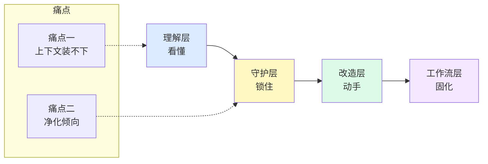
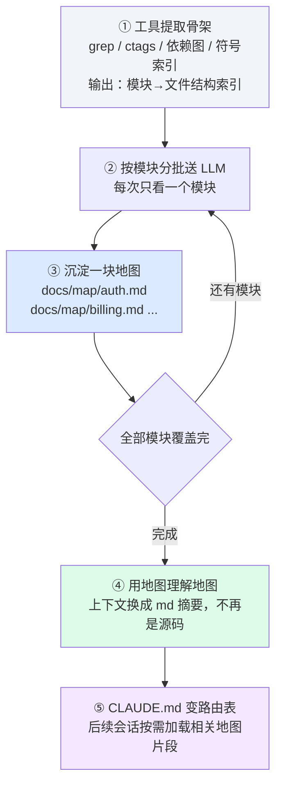
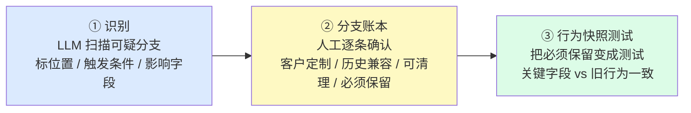

# 用大模型治理历史遗留代码：实践报告

> **数据来源**：内部工程师调查问卷（领域偏后端服务 / CDN / 直播流）。
> **数据说明**：本报告所有占比均来自问卷统计；引用同行做法时一律匿名，不含任何身份信息。
> **定位**：这是一份一线经验的浓缩，不是行业统计结论，请结合自身场景判断。

---

## 一、开篇：两个让人「不敢改」的痛

如果你维护过一个超过三五年的老仓库，下面的场景大概率不陌生：

- 想改一个模块，却没有文档；唯一懂它的人可能已经离职，或者自己也忘了当初为什么这么写。
- 代码里散落着大量补丁和「看起来很奇怪」的分支，删又不敢删，留又说不清。
- 某些逻辑是专门为某个客户定制的，藏在深处、没有标记——直到线上出事，才想起它的存在。

把这些困境收敛一下，就是本次分享要系统回答的**两个核心痛点**：

- **痛点一 · 理解与文档化**：历史代码文档不全、补丁多，如何用大模型帮研发人员把逻辑捋清楚、把文档补全，并适配到现代工作流中。
- **痛点二 · 特殊逻辑守护**：历史代码里针对特殊客户的特殊逻辑，在大模型协助整理时必须持续生效，不能被悄悄改掉或删掉，导致老问题复发。

这两个痛点不是理论假设。在我们的问卷里，**约三分之二的工程师亲历过大模型「悄悄丢掉」特殊逻辑**；更值得警惕的是，其中有人是在**线上服务出错之后**，甚至是在**做后续新功能时才偶然发现**——「之前大模型做优化时丢弃了部分特殊逻辑」（编号18）。

损伤发生在改动当下，暴露却在很久以后。这正是老仓库治理最危险的地方，也是这份报告要解决的核心问题。

---

## 二、数据画像：我们到底卡在哪

在给方法之前，先用问卷把「难」从感觉变成可定位的瓶颈。

### 2.1 三大障碍

问到「目前最大的障碍」，回答集中在三类：

| 障碍 | 占比 |
|---|---|
| 输出不稳定，不敢直接用 | 28.6% |
| 没有测试，无法验证对错 | 21.4% |
| 上下文装不下 | 17.9% |

这三类合计约 **67.9%**，而且并不是并列的三个独立问题——它们是一条因果链。老仓库先天缺测试，所以无法验证大模型的输出对不对；输出无法验证，自然「不敢直接用」；而上下文装不下，又让大模型连「看全」代码的机会都没有。有受访者一针见血：「上下文装不下的本质是人提供的信息密度不够高」（编号26）。

### 2.2 测试基线的缺口

改动老代码前是否先建立回归测试或行为快照：

| 回答 | 占比 |
|---|---|
| 会，这是前提 | 60.7% |
| 有时候会 | 21.4% |
| 一般不会 | 17.9% |

六成工程师已经把「先有测试基线再动手」当作纪律，但仍有近四成做不到。恰恰是「没有测试」与「特殊逻辑丢失」高度相关——没有行为基线，大模型就没有不可逾越的边界。

### 2.3 理解与沉淀的现状

读懂陌生老模块时，**半数（50.0%）**工程师第一步是让大模型「梳理调用关系/依赖图」，而非逐行解读。「先建立结构地图，再深入细节」已是主流共识。

沉淀环节的数据也不差：**约三分之二（64.3%）**写成独立文档同步 Wiki，17.9% 整理成代码注释，几乎无人完全不沉淀。但这里藏着一个问题——沉淀位置分散在 Wiki、注释、个人笔记之间，缺乏统一规范。每个人都在为同一个模块重建理解，知识难以复用。

### 2.4 一个被低估的盲区：线上验证

确认改动安全的手段中，**89.3%** 依赖测试、60.7% 依赖 review，但只有 **10.7%（3/28）**提到灰度、开关或监控。

多数人的安全验证止步于本地和测试环境。可前面提到的「线上出错才发现」案例，恰恰发生在缺乏灰度保护的场景。本地通过 ≠ 线上安全。

---

## 三、方法论：四层递进治理框架

把问卷里有效的做法拢在一起，发现它们落在**四个层次**上。不是并列的，而是层层递进、下层是上层的前提：

- 没有「理解」，就无从「守护」；
- 没有「守护」，就不能安全「改造」；
- 而「工作流」把前三层固化成团队能持续运转的机制。

两个痛点落在不同位置：**痛点一在理解层**，**痛点二在守护层**，改造层与工作流层是两者共同的保障。

### 前置 · 关键产物：先统一团队语言

在进入四层框架前，建议先统一几个核心产物的定义。否则团队里每个人都说「文档」「测试」「风险清单」，但实际指向的东西可能完全不同。

| 产物 | 解决的问题 | 推荐沉淀位置 |
|---|---|---|
| 模块地图 | 这个老模块从哪里进、怎么流转、依赖谁、先读哪里 | 仓库 `docs/`、模块 README、PR 描述 |
| 分支账本 | 哪些条件分支可能是客户定制、历史兼容、灰度开关或异常兜底 | `findings.md`、模块文档、PR 描述 |
| 不可破坏清单 | 哪些旧行为在重构中必须保持不变 | 测试用例、代码注释、CI 检查、PR checklist |
| 行为快照 | 旧代码在典型输入下的输出、副作用、错误码、日志字段、消息内容 | 测试 fixture、快照文件、回归脚本 |
| 显式行为变更 | 哪些行为是有意改变的，不能混在「纯重构」里 | 独立 PR、ADR、发布说明、灰度计划 |

理解结论沉淀到文档，行为约束沉淀到测试，设计取舍沉淀到 ADR，临时调研沉淀到 findings，而能被代码表达的知识尽量回流到类型、接口、注释和测试里。

### 第一层 · 理解层：先画地图，再读代码（对应痛点一）

老代码没有自解释性，硬啃成本极高。突破口不是让大模型逐行翻译，而是先让它帮你建结构地图：

1. **结构优先**。先让模型输出「模块地图」——对外暴露哪些入口、主要文件/函数各负责什么、核心数据结构与状态如何流转、依赖哪些外部系统、哪些是历史包袱、要改先读哪些文件。半数工程师的第一动作正是这个。
2. **从入口逐层展开**。先找入口函数 / handler，再沿调用链下钻，避免一上来淹没在细节里。
3. **文档化沉淀，且要分层**。把理解成果沉淀为可复用资产——有受访者的做法是「生成基础 / 入门 / 进阶 / 高阶四级 md 文档」（编号6），并「做好索引，AI 需要用时不必重复去找」（编号26）。
4. **提升信息密度，而非堆代码量**。与其把整个仓库塞给模型，不如「指定文件和方法让模型看」（编号11）、「提前写好 CLAUDE.md / AGENTS.md 排除不相关模块」（编号9）。上下文装不下，靠的不是更大的窗口，而是更高的信息密度。

**补充：大型项目（远超上下文）如何建图？**

地图不是一次会话生成的，而是跨多个会话逐步积累的工程资产。先用工具提取骨架，再按模块分批理解，最终用地图代替源码做上下文。

### 第二层 · 守护层：把隐性逻辑变成显式约束（对应痛点二 · 破局核心）

大模型有「净化倾向」——它会把看起来冗余、不优雅的分支当垃圾清理，而老代码里的特殊逻辑往往**长得就像垃圾**。有受访者点破了本质：「最大的障碍……是它很难天然知道哪些旧行为是业务资产，哪些只是历史垃圾」（编号16）；「过于强调优化，可能会导致 AI 丢掉历史包袱去重构」（编号22）。

三步把隐性知识显式化：

1. **识别**：让大模型扫描代码，列出所有「看起来像客户定制、历史兼容、灰度开关、特殊错误码、fallback」的逻辑，标出代码位置、触发条件、影响字段，并要求它对不确定的地方明确标「不确定」，不许脑补。
2. **建清单**：把识别结果整理成一份**「不可破坏清单」**（branch ledger / 分支账本），逐条人工确认：哪些是客户定制、哪些是历史兼容、哪些可清理、哪些必须保留。
3. **变测试**：把清单里每条不可破坏的行为，转成**行为快照测试**——锁住「关键输出字段是否与旧行为一致」，而不只是「功能能不能跑」。

> 为什么不能只靠在对话里说「这段别动」？因为口头声明只活在单次对话里。问卷中确有工程师靠对话声明保护（编号8、编号12、编号28），但仍有约三分之二的人遭遇过特殊逻辑丢失——**Prompt 声明是最脆弱的防线**。保护规则必须外化到代码注释和测试里，让大模型每次读上下文时都「看得见」。一个朴素但有效的技巧：「在不符合常规设计的地方加注释保护，AI 读到了就不会乱改」（编号26）。

### 第三层 · 改造层：小步、可审、可回退

即便理解到位、守护到位，改动本身仍可能引入回归。

1. **最小改动原则**。「要求改动尽量小」「重构和修 bug 分开做，一次只动一个点，绝不在改结构的时候顺手改逻辑」（编号20）。明确禁止模型「顺便优化」无关代码。
2. **diff 行为审查**。改完先看 diff：有没有删掉特殊分支？有没有改默认值、调用顺序、重试次数、超时、fallback？再让模型「只审查这次 diff 的行为风险」，把它从「代码审美模式」拉回「行为风险控制模式」。
3. **多视角 review**。让第二个模型审查第一个模型的输出，专审兼容性问题；复杂改动用更强的模型 review；关键路径必须人工逐行 review。有受访者称之为「攻击性评审」——主动让模型找自己输出的弱点，而非期待它自我纠错（编号24）。
4. **灰度兜底**。高风险路径加开关、日志、灰度：「先放 1% 的流量跑一跑，盯着监控没问题再全量，万一出事立马切回」（编号20）；或「新旧入口并行，先灰度回归再替换老入口」（编号18）。

### 改造补充：风险分级，决定 AI 能做到哪一步

不是所有老代码都适合同一种 AI 协作模式。一个实用的做法是先给改动分级，再决定大模型只做理解、可以补测试，还是可以参与改代码。

| 风险等级 | 典型场景 | 建议做法 |
|---|---|---|
| 低风险 | 注释、文档、日志文案、非运行时说明 | AI 可直接生成草稿，人工快速 review |
| 中风险 | 抽函数、整理重复代码、调整内部结构，理论上不改变输入输出 | 必须有行为快照或单测覆盖，diff 重点审查默认值、错误码、空值和调用顺序 |
| 高风险 | 客户分支、鉴权、计费、状态机、数据写入、MQ、回调、灰度开关、老版本兼容 | 必须建立不可破坏清单，补回归测试或快照，灰度发布，并准备回滚方案 |
| 禁止自动改 | 没有 owner、没有测试、没有线上观测、影响面不清楚的核心链路 | AI 只允许做理解、文档、风险清单，不允许直接提交代码改动 |

这张表想划清的是边界：**越接近业务契约和线上副作用，越不能让模型凭「看起来等价」自行判断安全性**。

### 第四层 · 工作流层：把做法固化成机制

这些做法若只存在于个别人手里，就无法对抗「输出不稳定」，也无法在团队里推开。

1. **文档驱动 / 想和干分开**。最成熟的反脆弱实践是：先让大模型出方案文档（md），人工审核确认，再让它动代码。「想和干分开」（编号11）、「每个模块都要有喂给大模型的 md 文件，包括约束、目标、测试流程等规则，先有文档再让大模型动代码」（编号17）、「plan-execute 模式，plan 时出技术文档，包含参考代码位置、修改文件、需求背景、实现方向」（编号19）。
2. **人工确认闭环**。大模型只产出草稿，最终文档与代码变更必须经过人工确认节点，不直接落库。
3. **CI 持续守护**。把「不可破坏清单」接进 CI：变更若触及已标注的特殊逻辑，自动触发相关测试并要求人工 review，并产出「特殊逻辑覆盖率」报告。

### 补充 · 产物腐化怎么办？

随着重构推进，前期产出的地图、账本、文档会逐渐过时。这是不可避免的，但不同产物的腐化代价差异很大：

| 产物 | 腐化后果 | 策略 |
|---|---|---|
| 行为快照测试 | 测试失败，立即可见 | 让 CI 兜底，腐化会主动暴露，无需额外维护 |
| 不可破坏清单 | 下次重构丢失保护 | 随代码同步更新，写进 PR checklist |
| 模块地图 | 理解成本升高 | 允许腐化，改动前按需重新生成即可 |

把「不可破坏」的约束变成测试，而不是文档——测试腐化是吵闹的（CI 报红），文档腐化是静默的（没人知道它过时了）。叙述性文档（地图、摘要）的定位是降低理解成本的辅助工具，用 agent 重新生成的成本远低于人工持续维护，不必追求永远最新。

---

## 四、实战案例：真实有效的做法

以下案例均来自问卷开放题，忠实于受访者原述。

### 案例 A（旗舰）· 三步法治理直播流播放链路 —— 编号16

**背景**：某 `streamd` 播放链路历史很长，混杂着老版本播放地址兼容、不同 CDN / 域名分支、不同业务线的定制参数、推流断流重试补丁，还有一些「看起来多余、实际被日志或运维脚本依赖」的字段。团队想整理，但**不敢动**——分不清哪些是历史垃圾，哪些是线上仍依赖的特殊逻辑。

**做法**：不让大模型一上来就写代码，而是先做「代码考古」，分三步：

1. **入口地图**：让模型找出播放地址生成链路从哪个 API / handler 进入，标出核心函数、配置读取点、外部依赖和主要调用路径——先收住阅读范围，不让无关模块卷进来。
2. **分支账本**：把所有与域名、CDN、App、客户、协议、清晰度、鉴权、过期时间、回调字段相关的条件分支逐条列出，每条记录位置、触发条件、影响字段、可能的业务含义，以及「重构时若丢掉它，可能造成什么线上风险」。
3. **行为快照**：基于账本为典型场景（默认 App、特殊 App、不同 CDN、鉴权开关、过期边界、配置缺失、异常返回）生成输入输出表，**先锁住旧代码的真实行为**，再动手。

之后才进入小范围重构（只抽取重复签名逻辑、整理配置读取与 URL 拼接），并明确禁止改变 URL 结构、错误码、日志关键字段、默认值与空值行为；如确需改变行为，单独列为「显式行为变更」，不混进重构。

**效果**：团队对老代码的态度从「不敢改」变成「知道哪里不能动」；发现了若干「播放端不用、但运维/日志依赖」的隐藏字段——有几个是在整理分支账本时才第一次被人完整写下来，之前只活在原作者脑子里；重构范围显著缩小；回归验证从「能不能播」升级为「关键字段是否与旧行为一致」；入口地图 / 分支账本 / 行为快照本身成为可复用的工程资产。

> 这位受访者的一句话值得作为整份报告的注脚：**「老代码里的特殊逻辑，先当成文物保护，不当成垃圾清理。先标出来、测起来、写下来，再改。」**

### 案例 B · 先定验收标准，再让 AI 开写 —— 编号27

不直接让 AI 动手，而是先给它一份结构化的验收标准：**背景**（为什么改）、**目标**（改完达到什么效果）、**限制**（不能改哪些）、**风险**（哪些地方可能出问题）。AI 在这个框架内生成方案，再按验收标准自检。配套动作：改前查历史提交 / 工单 / 客户配置 / 注释确认来源，补回归或快照测试，小步修改，高风险加开关、日志、灰度与回滚方案。

> 变化在驱动模式上：不是告诉 AI 怎么做，而是告诉它做完要满足什么条件。

### 案例 C · TDD 前置：先锁行为，再改代码 —— 编号5

1. 让 AI 梳理现有逻辑并出文档
2. 基于文档生成覆盖**现有行为**的单测——此时单测是「行为快照」，不是新功能测试
3. 在单测保护下改动，改完再让 AI 基于单测 review

并坚持「特殊逻辑函数入口必须有注释 + 测试用例覆盖」。

### 案例 D · PR 级 API 回归自动化 —— 编号20

自研一个 skill：每次 PR 提交时，让模型分析本次涉及的 API 改动，自动生成**真实 HTTP 请求**做回归验证，校验状态码与响应字段，并把结果评论到 PR 上。设计重点是「不只看代码、不只写建议，而是实际调用接口验证结果」，减少「代码看着对但接口跑不通」的问题。

### 案例 E · 多源信息组合，快速定位线上问题 —— 编号14、编号8

把**问题现象 + 监控图表 + 服务日志（人工过滤出关键日志）+ 涉及的代码文件**一起喂给大模型，让它给出根因与最小修复建议。实践反馈是「有时候比人更快」。

> 经验：代码上下文、运行时上下文（日志/监控）、问题现象三者缺一不可，组合输入远胜于单独喂代码或单独喂日志。

---

## 五、落地清单：明天就能用

本章要点也整理成了一页纸速查（`report/一页纸速查.md`），包含可复制的 Prompt 模板、不可破坏检查点和验收标准四要素，方便团队直接取用。

### 5.1 推广路径：先试点，再铺开

1. **选一个模块试点**：挑一个「危险但不致命」的老模块，完整走一遍四层框架，产出第一份入口地图 + 不可破坏清单 + 行为快照。
2. **沉淀模板**：把试点中好用的 Prompt、清单格式、CI 检查固化为团队模板。
3. **接入 CI**：把不可破坏清单接进流水线，变更触及即触发测试 + 人工 review。
4. **团队复制**：以试点产物为样例，逐模块推广，形成可复用的知识库。

### 5.2 几类容易踩的坑

1. **任务描述太宽**：写成「帮我重构这个模块」，模型会带着自己对「更好的代码」的理解扫过去，特殊逻辑往往就在这时消失。「顺便优化」同理——用它等于邀请模型扩大改动范围。
2. **只喂代码，不喂上下文**：不提供日志、配置、历史工单或真实流量证据，模型判断「这段能不能删」时只能靠代码看起来像不像垃圾。
3. **重构和行为变更混在一个 PR**：两周后发现某个客户的回调字段变了，根本回溯不到是哪次改动动了它。分开提交不是仪式感，是事后可追溯的前提。
4. **用 prompt 声明代替约束**：「这段特殊逻辑不要动」只活在单次对话里。约束必须外化到注释、测试和 CI 里，才能每次都「看得见」。

### 5.3 可观察的效果指标

为了避免治理工作停留在「感觉更稳了」，试点阶段可以记录少量指标。哪怕先手工记录，也能帮助团队判断 AI 治理到底是在降低风险，还是只是让文档变多。

**产出类**
- 是否产出模块地图 / 分支账本 / 不可破坏清单 / 行为快照
- 高风险分支中有测试或快照保护的比例
- PR 中是否显式声明行为变更

**守护类**
- 触及特殊逻辑时是否触发对应测试

**结果类**
- 老模块改动后的回滚次数
- 兼容逻辑丢失导致的线上问题数
- 同一模块重复考古的次数

---

## 六、局限性（请结合自身场景判断）

- **小样本**：样本量有限，不构成统计显著性结论，应视为一线经验的浓缩而非行业普查。
- **领域偏向**：样本集中在后端服务 / CDN / 直播流，前端、数据、嵌入式等领域的结论可能不同。
- **单一组织来源**：工具链与工程文化相对同质，迁移到其他组织时需重新验证。
- **自报偏差**：问卷为自我报告，「没遇到特殊逻辑丢失」也可能是「尚未发现」。

> 但有一条结论跨场景成立——**在让大模型动手之前，先用它把隐性知识显式化，并以测试和文档固化为可验证的约束**。这既是文档化痛点的解法，也是特殊逻辑守护痛点的解法。

